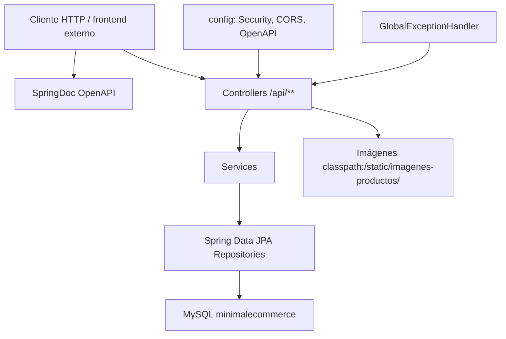

# Documentación de MinimalEcommerce

Análisis del repositorio `minimalecommerce` (GitHub: `julianmeoficial/minimalecommerce`). Complementa el [README.md](README.md) (estado y arranque) y [REESTRUCTURA.md](REESTRUCTURA.md) (fallas y enfoque futuro).

---

## 1. Función

MinimalEcommerce es el **backend REST de un marketplace de comercio electrónico** con dos roles:

- **COMPRADOR:** navega catálogo, carrito, checkout, pedidos, reseñas, favoritos, direcciones, preórdenes y notificaciones.
- **VENDEDOR:** publica productos, gestiona stock, ve pedidos de sus artículos, emite cupones, consulta métricas, publica blog/eventos y recibe reseñas.

La API habla español en nombres de dominio (`usuario`, `pedido`, `resena`, `cupon`) y está pensada para un frontend separado (CORS hacia `localhost:3000`). Ese frontend **no forma parte de este repositorio**.

No hay pasarela de pago, envíos reales, ni autenticación de producción. La función actual es **exponer un modelo de negocio completo por HTTP** para desarrollo local o trabajo académico.

---

## 2. Core

El núcleo comercial es el ciclo de compra:

```
Usuario (COMPRADOR)
  → Producto (publicado por Usuario VENDEDOR, en Categoria)
    → Carritoitem (cantidad + precio unitario congelado)
      → Pedido + Pedidoitem
        → descuento de stock
        → EstadoPedido (PENDIENTE → CONFIRMADO → ENVIADO → ENTREGADO | CANCELADO)
```

Todo lo demás orbita ese núcleo:

| Capa alrededor del core | Piezas |
|---|---|
| Identidad | `Usuario`, `TipoUsuario`, login/registro |
| Catálogo | `Producto`, `Categoria`, imágenes, flag `espreorden` |
| Promoción | `Cupon` (porcentaje / monto fijo) |
| Post-compra | `Resena`, `Favorito`, `Notificacion` |
| Logística ligera | `Direccion`, `Preorden` |
| Contenido / marketing | `Blog`, `Evento` |
| Analítica rudimentaria | `Metricavendedor` |

Si se elimina blog, eventos o métricas, el marketplace sigue siendo reconocible. Si se elimina carrito → pedido → stock, deja de ser e-commerce.

---

## 3. Determinación

El proyecto se determina como **prototipo / aplicación base**, no como producto en producción.

Evidencia en el propio repo:

- Versión Maven `0.0.1-SNAPSHOT` y descripción *«E-commerce minimalista»*.
- Historial corto: `Inicialización del repositorio con código base` → `nuevas tablas` → `APLICACION BASE OOo`.
- Comentarios de desarrollo (`NUEVO CAMPO`, `CORREGIDO`, `para desarrollo local - sin encriptación`).
- `SecurityConfig` abre todas las rutas; BCrypt está cableado y el login compara texto plano.
- Configuración de vistas HTML estáticas (`/static/html/`) **sin esos archivos**.
- `ImagenService` busca primero `.../backend/src/main/resources/...`, rastro de un monorepo que ya no está.

Conclusión: es una **API de laboratorio** para un marketplace comprador/vendedor, lista para demostrar flujos en local, no para operar tráfico real.

---

## 4. Arquitectura

Arquitectura **en capas clásica de Spring Boot**, un solo módulo Maven, un solo proceso (Tomcat embebido).



### 4.1 Paquetes

Raíz: `com.minimalecommerce.app`

| Paquete | Piezas | Rol |
|---|---|---|
| *(raíz)* | `MinimalecommerceApplication` | Arranque `@SpringBootApplication` |
| `config` | `SecurityConfig`, `WebConfig`, `SwaggerConfig` | Seguridad abierta, CORS, estáticos, OpenAPI |
| `controller` | 17 clases | HTTP, `Map<String, Object>` y entidades |
| `service` | 16 clases | Reglas de negocio y orquestación |
| `repository` | 15 interfaces | Spring Data JPA + queries derivadas/`@Query` |
| `model` | Entidades + enums | Modelo persistente = contrato JSON |
| `exception` | `GlobalExceptionHandler` | `RuntimeException` → 400; resto → 500 |

No hay paquetes `dto`, `security` (JWT/filtros), `mapper` ni módulos por dominio. La frontera HTTP es la entidad JPA.

### 4.2 Persistencia

- Hibernate `ddl-auto=update` (el esquema evoluciona al arrancar, sin migraciones versionadas).
- Dialect: `org.hibernate.dialect.MySQLDialect`.
- Relaciones típicas: `@ManyToOne` con `FetchType.EAGER` (salvo `Cupon.creador`, que es `LAZY` + `@JsonIgnore`).
- Identificadores: `IDENTITY`.
- Nombres de columna en minúsculas pegadas (`fecharegistro`, `vendedorid`, `direccionentrega`).

### 4.3 Configuración HTTP

- Puerto `8080`.
- CORS en `WebConfig` para `/api/**` (`localhost:*`, `127.0.0.1:*`, `localhost:3000`) y otra vez en `application.properties` (solo `http://localhost:8080`). Gana la configuración Java para el mapeo `/api/**`.
- CSRF deshabilitado.
- Multipart hasta 10 MB.
- Compresión HTTP activada; caché de estáticos desactivada en properties y 2 h en el handler de imágenes.

### 4.4 Flujo de checkout (resolución del core)

`POST /api/carrito/procesar-pedido` → `CarritoitemService.procesarPedido`:

1. Carga ítems del usuario.
2. Valida carrito no vacío y stock.
3. Suma subtotales (`preciounitario * cantidad`).
4. Crea `Pedido` en `PENDIENTE` con dirección de entrega.
5. Crea `Pedidoitem` por línea y descuenta stock.
6. Vacía el carrito.
7. Devuelve pedido + ítems.

El parámetro `cuponId` se lee en el controlador y **no se usa** en el servicio. No hay transacción de pago.

---

## 5. Resolución (qué sí está resuelto)

Con la API en marcha y MySQL disponible, el código **sí cubre** un MVP local:

| Capacidad | Resolución |
|---|---|
| Identidad dual | Registro comprador/vendedor, listados por tipo, cambio de rol |
| Catálogo | CRUD, búsqueda, rango de precio, por categoría, por vendedor, populares, preorden, stock |
| Carrito | Alta, cantidad, borrado, conteo, checkout con validación de stock |
| Pedidos | Por usuario, por vendedor, detalle con líneas, cambio de estado, cancelación si no está entregado, estadísticas de comprador |
| Cupones | CRUD, vigencia, usos máximos, porcentaje/monto fijo, stats de vendedor |
| Reseñas | Por producto/comprador/vendedor, promedio, “puede reseñar” |
| Favoritos | Toggle, conteo, notificación de stock |
| Direcciones | CRUD, principal, contador |
| Preórdenes | Alta, estados, por usuario/vendedor/producto |
| Notificaciones | Alta, no leídas, marcar leída, por tipo |
| Contenido | Blog (publicar, buscar) y eventos (próximos, desactivar) |
| Métricas | Resumen, rango de fechas, último mes |
| Imágenes | Subida UUID, servir por classpath, editar/agregar/borrar ligadas a producto |
| Observabilidad de API | Swagger UI sobre `/api/**` |
| Errores | Handler global con timestamp / mensaje / status |

Eso es **cobertura funcional de código**, no madurez operativa. Varios de esos flujos fallan o se degradan por los huecos de la sección 8.

---

## 6. Inventario de dominio

### 6.1 Entidades JPA

| Entidad | Tabla | Relación principal |
|---|---|---|
| `Usuario` | `usuario` | Identidad; `tipousuario`, `activo` |
| `Categoria` | `categoria` | Nombre único |
| `Producto` | `producto` | `categoria`, `vendedor`; `espreorden`, `stock`, `imagen` |
| `Carritoitem` | `carritoitem` | `usuario` + `producto`; `preciounitario`, `getSubtotal()` |
| `Pedido` | `pedido` | `usuario`; `total`, `estado`, `direccionentrega` |
| `Pedidoitem` | `pedidoitem` | `pedido` + `producto`; `getSubtotal()` |
| `Cupon` | `cupon` | `creador`; código único, vigencia, usos |
| `Resena` | `resena` | `usuario`/`comprador`, `producto`, `vendedor` |
| `Favorito` | `favorito` | `usuario` + `producto`; `notificarstock` |
| `Direccion` | `direccion` | `usuario`; `principal`, `activa` |
| `Preorden` | `preorden` | `usuario` + `producto`; `preciopreorden`, `estado` |
| `Notificacion` | `notificacion` | `usuario`, `remitente`; tipo, prioridad, estado de envío |
| `Blog` | `blog` | `autor`, `categoria` |
| `Evento` | `evento` | `usuario` organizador |
| `Metricavendedor` | `metricavendedor` | `vendedor` + `fecha`; ventas, pedidos, visitas |

`Carritoitem` y `Cupon` no usan Lombok; el resto sí (`@Data`). En `Producto` hay getters/setters duplicados sobre Lombok.

### 6.2 Enums

| Enum | Valores |
|---|---|
| `TipoUsuario` | COMPRADOR, VENDEDOR |
| `EstadoPedido` | PENDIENTE, CONFIRMADO, ENVIADO, ENTREGADO, CANCELADO |
| `EstadoPreorden` | PENDIENTE, CONFIRMADA, PRODUCCION, LISTA, ENTREGADA, CANCELADA |
| `TipoCupon` | PORCENTAJE, MONTO_FIJO |
| `TipoNotificacion` | CARRITO, DESCUENTO, EVENTO, INFORMATIVA, NUEVO_PRODUCTO, PEDIDO, PRODUCTO, PROMOCION, SISTEMA, STOCK, URGENTE |
| `Notificacion.EstadoEnvio` | PENDIENTE, ENVIADA, PROGRAMADA, FALLIDA |
| `Notificacion.Prioridad` | ALTA, BAJA, NORMAL, URGENTE |
| `Notificacion.DestinatarioTipo` | INDIVIDUAL, GRUPO, TODOS |

---

## 7. Mapa de endpoints

Base: `http://localhost:8080`.

### Auth — `/api/auth`

| Método | Ruta | Acción |
|---|---|---|
| POST | `/login` | Login (texto plano); limpia `password` en la respuesta |

### Usuarios — `/api/usuarios`

| Método | Ruta | Acción |
|---|---|---|
| POST | `/registro` | Alta comprador (por defecto) |
| POST | `/registro/vendedor` | Alta vendedor |
| POST | `/login` | Login duplicado (query email+password en BD) |
| GET | `/` | Usuarios activos |
| GET | `/{id}` | Por id |
| GET | `/email/{email}` | Por email |
| GET | `/compradores` | Compradores activos |
| GET | `/vendedores` | Vendedores activos |
| GET | `/tipo/{tipo}` | Por `TipoUsuario` |
| GET | `/estadisticas` | Conteos por rol |
| GET | `/buscar/{nombre}` | Búsqueda por nombre |
| GET | `/verificar-email/{email}` | ¿Existe el email? |
| PUT | `/{id}` | Actualizar |
| PUT | `/{id}/tipo` | Cambiar rol |
| DELETE | `/{id}` | Desactivar (`activo=false`) |

### Productos — `/api/productos`

| Método | Ruta | Acción |
|---|---|---|
| GET | `/` | Activos |
| GET | `/{id}` | Detalle |
| GET | `/categoria/{categoriaId}` | Por categoría (con stock) |
| GET | `/disponibles` | Con stock |
| GET | `/buscar/{nombre}` | Por nombre |
| GET | `/precio` | `precioMin` / `precioMax` |
| GET | `/populares` | Query de populares |
| GET | `/vendedor/{vendedorId}` | Todos los del vendedor |
| GET | `/preorden` | Flag `espreorden` |
| POST | `/` | Crear |
| POST | `/crear-con-imagen` | Multipart (no asigna vendedor) |
| PUT | `/{id}` | Actualizar |
| PUT | `/{id}/stock` | Stock |
| DELETE | `/{id}` | Desactivar |
| DELETE | `/eliminar-completo/{id}` | Borrado físico |

### Categorías — `/api/categorias`

GET `/`, `/{id}`, `/nombre/{nombre}`, `/buscar/{texto}` · POST `/` · PUT `/{id}` · DELETE `/{id}`

### Carrito — `/api/carrito`

| Método | Ruta | Acción |
|---|---|---|
| POST | `/agregar` | `usuarioId`, `productoId`, `cantidad` |
| GET | `/usuario/{usuarioId}` | Ítems |
| PUT | `/actualizar-cantidad` | `itemId`, `cantidad` |
| DELETE | `/eliminar/{itemId}` | Quitar línea |
| DELETE | `/limpiar/{usuarioId}` | Vaciar |
| GET | `/contar/{usuarioId}` | Conteos |
| POST | `/procesar-pedido` | Checkout (`usuarioId`, `direccionEntrega`, `cuponId` ignorado) |

### Pedidos — `/api/pedidos`

GET `/usuario/{usuarioId}`, `/{id}`, `/vendedor/{vendedorId}`, `/usuario/{usuarioId}/estadisticas` · PUT `/{id}/estado`

### Ítems de pedido — `/api/pedidoitems`

CRUD estándar y GET `/pedido/{pedidoId}`

### Cupones — `/api/cupones`

POST `/`, `/aplicar`, `/validar` · GET `/{id}`, `/codigo/{codigo}`, `/validos`, `/vendedor/{vendedorId}`, `/vendedor/{vendedorId}/activos`, `/vendedor/{vendedorId}/contador`, `/vendedor/{vendedorId}/proximos-vencer`, `/estadisticas/vendedor/{vendedorId}`, `/health` · PUT `/{id}`, `/{id}/desactivar` · DELETE `/{id}` · GET `/mantenimiento/desactivar-vencidos`

### Reseñas — `/api/resenas`

CRUD · por producto (lista, promedio, verificadas) · por usuario/comprador/vendedor · `puede-resenar` · estadísticas · por calificación

### Favoritos — `/api/favoritos`

POST `/`, `/toggle` · GET `/usuario/{usuarioId}`, verificar producto, contador, `/productos-populares` · DELETE por usuario+producto · PUT `/{id}/notificacion-stock`

### Direcciones — `/api/direcciones`

POST `/` · GET `/usuario/{usuarioId}`, `/principal`, `/contador` · PUT `/{id}`, `/{id}/establecer-principal` · DELETE `/{id}`

### Preórdenes — `/api/preordenes`

GET `/`, `/{id}`, por usuario/vendedor/producto/estado, estadísticas · POST `/`, `/crear` · PUT `/{id}`, `/{id}/estado`, `/{id}/cancelar` · DELETE `/{id}`

### Notificaciones — `/api/notificaciones`

POST `/` · GET por usuario, no leídas, contador, tipo, estadísticas/historial de vendedor · PUT marcar leída / todas · DELETE `/{id}`

### Blog — `/api/blogs`

GET `/`, `/{id}`, `/autor/{autorId}`, `/categoria/{categoriaId}`, `/buscar/{titulo}`, `/contenido/{palabra}` · POST `/` · PUT `/{id}`, `/{id}/publicar` · DELETE `/{id}`

### Eventos — `/api/eventos`

GET `/`, `/{id}`, `/usuario/{usuarioId}`, `/proximos`, `/buscar/{titulo}` · POST `/` · PUT `/{id}`, `/{id}/desactivar` · DELETE `/{id}`

### Métricas — `/api/metricas-vendedor`

GET `/vendedor/{vendedorId}`, `/rango`, `/resumen`, `/ultimo-mes` · POST `/vendedor/{vendedorId}/actualizar` · PUT `/{id}`

### Imágenes — `/api/imagenes`

POST `/subir`, `/editar/{productoId}`, `/agregar/{productoId}` · GET `/test-imagenes`, `/verificar/{nombreImagen}`, `/producto/{productoId}`, `/imagenes-productos/{filename}` · DELETE `/{nombreImagen}`, `/producto/{productoId}`

---

## 8. Datos semilla y estáticos

| Archivo | Contenido | ¿Se aplica solo? |
|---|---|---|
| `data.sql` | 5 categorías + 3 usuarios demo | No: `spring.sql.init.mode=embedded` (MySQL no es embedded) |
| `data-nuevas-tablas.sql` | Un pedido dummy | No |
| `data-nuevas-3-tablas.sql` | 3 eventos + 3 posts de blog | No |

Imágenes: ~17 archivos UUID en `src/main/resources/static/imagenes-productos/` (jpg, png, webp, jpeg). Se sirven en `/imagenes-productos/**`.

---

## 9. Tecnologías

### 9.1 Lenguaje y build

| Tecnología | Uso |
|---|---|
| Java 17 | Lenguaje |
| Apache Maven | Build (`pom.xml`) |
| Maven Wrapper | `mvnw` / `mvnw.cmd` |
| Spring Boot 3.5.0 | Parent y runtime |

### 9.2 Frameworks Spring

| Artefacto | Uso |
|---|---|
| `spring-boot-starter-web` | REST, Tomcat embebido, Jackson |
| `spring-boot-starter-data-jpa` | ORM Hibernate, repositorios |
| `spring-boot-starter-security` | `SecurityFilterChain` + `PasswordEncoder` |
| `spring-boot-starter-validation` | Bean Validation (poco usado en controladores) |
| `spring-boot-devtools` | Restart / LiveReload |
| `spring-boot-starter-test` | JUnit 5, MockMvc, AssertJ (casi sin tests) |
| `spring-boot-maven-plugin` | Empaquetado ejecutable |

### 9.3 Persistencia y API

| Tecnología | Uso |
|---|---|
| MySQL | BD (`mysql-connector-j`, scope runtime) |
| Hibernate / JPA | Entidades, `ddl-auto=update` |
| SQL scripts | Seed manual |
| SpringDoc OpenAPI 2.1.0 | Swagger UI + `/v3/api-docs` |
| Lombok | Boilerplate en la mayoría de entidades |
| BCrypt (`PasswordEncoder`) | Declarado; no usado en registro/login |
| Multipart / NIO `Files` | Subida de imágenes al filesystem |

### 9.4 Qué no hay en el stack

No hay frontend (React/Next/Vue), Docker, docker-compose, Flyway/Liquibase, JWT/OAuth2, Redis, colas (Rabbit/Kafka), pasarela de pago, email/SMS, almacenamiento de objetos (S3/R2), CI/CD, `.gitignore`, perfiles `dev`/`prod`, ni API Gateway.

---

## 10. Tests y calidad

Único test: `MinimalecommerceApplicationTests.contextLoads`. Requiere MySQL real (`@SpringBootTest` sin Testcontainers ni perfil in-memory).

No hay tests de servicio, contrato HTTP, ni de checkout. Los controladores usan `System.out.println` / emojis en lugar de un logger. `GlobalExceptionHandler` convierte cualquier `RuntimeException` en HTTP 400, incluido “no encontrado”.

---

## 11. Límites del estado actual (resumen)

Estos puntos se desarrollan en [REESTRUCTURA.md](REESTRUCTURA.md):

1. Seguridad abierta y secretos en el repo.
2. Contraseñas en texto plano; login duplicado e inconsistente.
3. Seed SQL inerte contra MySQL.
4. Cupón ignorado en checkout; producto-con-imagen sin vendedor.
5. Entidades JPA como DTO; `EAGER` generalizado.
6. Imágenes en el árbol fuente; no sobreviven un JAR.
7. `target/` versionado; sin Docker ni CI.
8. Sin pagos, sin frontend, sin paginación, sin tests de negocio.

La **resolución** del proyecto es: un backend de marketplace con superficie funcional amplia y cimientos de producto estrechos. Sirve para entender el dominio y para un cliente local de prueba; no para operar.
