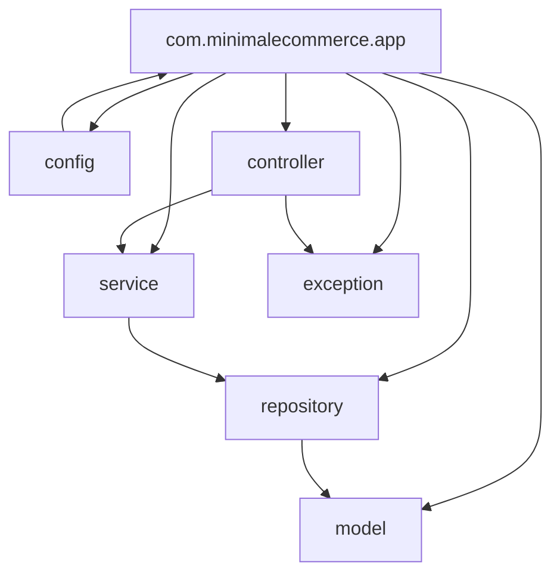

# MinimalEcommerce — árbol de archivos

Sin Spring Boot, Maven ni código. Solo **carpetas y relaciones** para reconstruir.

Memoria del prototipo: [docs/README.md](docs/README.md).

## Árbol

```
.
├── README.md
├── DOCUMENTACION.md          # histórico
├── REESTRUCTURA.md           # histórico
├── .gitignore
├── docs/                     # plan y diagramas (no es runtime)
└── src/
    ├── main/
    │   ├── java/com/minimalecommerce/app/
    │   │   ├── config/
    │   │   ├── controller/
    │   │   ├── service/
    │   │   ├── repository/
    │   │   ├── model/
    │   │   └── exception/
    │   └── resources/
    └── test/java/com/minimalecommerce/app/
```

## Relaciones (paquetes)



Las carpetas están vacías (`.gitkeep`). No hay `pom.xml`, `Application`, ni dependencias.
