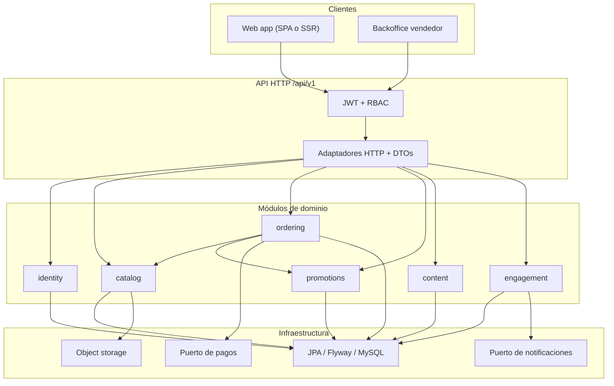

# Fallas, actualizaciones y reestructura de MinimalEcommerce

> **Histórico.** El prototipo en `src/` está declarado **obsoleto**. La documentación canónica de remodelación (diagramas Mermaid, contrato API, cambio de enfoque y de stack) está en **[docs/README.md](docs/README.md)**.

Este documento no describe cómo está el código (eso está en [DOCUMENTACION.md](DOCUMENTACION.md)). Describe **por qué no escala**, **qué conviene arreglar ya** y **qué arquitectura distinta** debería sustituir al CRUD anémico actual.

La tesis: no conviene partir este backend en microservicios. Conviene convertirlo en un **monolito modular por dominios**, con frontera HTTP desacoplada del modelo JPA, autenticación real y un frontend que no viva dentro de Spring MVC.

---

## 1. Fallas

### 1.1 Seguridad (bloqueante)

| Falla | Dónde | Efecto |
|---|---|---|
| Todas las rutas `permitAll()` | `SecurityConfig` | Cualquiera crea pedidos, borra productos, cambia roles |
| CSRF desactivado | `SecurityConfig` | Aceptable en API tokenizada; aquí no hay tokens |
| Contraseñas en texto plano | `UsuarioService.registrarUsuario` / `authenticateUser` | `PasswordEncoder` existe y no se usa; login hace `password.equals(...)` |
| Login por query JPQL | `UsuarioRepository.findByEmailAndPassword` | Compara hash (si algún día hubiera) en SQL; hoy compara plano |
| Secretos en git | `application.properties` | Usuario/clave MySQL versionados |
| Entidades con `password` en JSON | `Usuario` expuesto en listados | El login de `/api/usuarios/login` **no** limpia la contraseña; `/api/auth/login` sí |
| IDs de usuario en la URL | Casi todos los GET `/usuario/{id}` | Sin sesión: enumeración y suplantación trivial |

Esto no es “deuda menor”. El modelo de amenaza actual es **confianza total en el cliente**.

### 1.2 Datos y arranque

- `spring.sql.init.mode=embedded` → `data.sql` no corre contra MySQL. El README promete usuarios demo que la app no inserta sola.
- `data-nuevas-tablas.sql` y `data-nuevas-3-tablas.sql` son scripts huérfanos.
- `ddl-auto=update` es el único “versionado” de esquema. No hay historial, no hay rollback, no hay entornos reproducibles.
- Pedido dummy con `total = 0.00` y dirección «por definir» contamina cualquier demo si alguien ejecuta el SQL a mano.

### 1.3 Checkout incompleto

`POST /api/carrito/procesar-pedido` acepta `cuponId` y el servicio **ignora el parámetro**. El módulo de cupones está bien desarrollado (vigencia, usos, porcentaje/monto fijo) y **no está conectado al cobro**.

Tampoco hay:

- Recálculo de total con descuento
- Reserva de stock vs. descuento inmediato (condición de carrera entre dos checkouts)
- Idempotencia (doble POST = doble pedido)
- Pago
- Snapshot de dirección estructurada (solo un `String`)

`@Transactional` está en `CarritoitemService`, lo cual es correcto, pero no cubre concurrencia de stock.

### 1.4 Catálogo e imágenes

- `POST /api/productos/crear-con-imagen` no asigna `vendedor`. La columna es `nullable = false`. El alta “feliz” del panel vendedor puede fallar o persistir inconsistente.
- La subida escribe en `src/main/resources/static/imagenes-productos/`. En un JAR empaquetado esa ruta no existe o no es escribible.
- `ImagenService` busca primero `.../backend/src/...` (monorepo desaparecido) y luego el path actual. Dos lógicas de path, `System.out` de debug, y un segundo path hardcodeado en `ProductoController`.
- Un producto tiene un solo campo `imagen` (String), pero el servicio habla de listas separadas por comas: el modelo y la API no coinciden.

### 1.5 Diseño de API

- **Sin DTOs.** Hibernate serializa grafos `EAGER` (usuario dentro de producto dentro de carrito…). Riesgo de ciclos, payloads enormes y fugas de campos.
- Login duplicado: `/api/auth/login` vs `/api/usuarios/login` (comportamiento distinto respecto a la contraseña).
- Contratos heterogéneos: a veces la entidad, a veces `Map<String, Object>`, a veces `"success": "true"` como String.
- Sin paginación en listados (`obtenerTodosProductos`, pedidos, reseñas).
- Sin versionado (`/api/v1`).
- IDs numéricos consecutivos y enumerables.
- Validación Bean Validation apenas usada; las reglas viven en `if` + `RuntimeException`.

### 1.6 Operación y calidad

- No hay `.gitignore`; `target/` (clases compiladas y `application.properties` con secretos) está en git.
- No hay Docker, perfiles, ni CI.
- Un test: `contextLoads`, acoplado a MySQL local.
- `System.out.println` / emojis en controladores y servicios.
- `GlobalExceptionHandler`: todo `RuntimeException` es HTTP 400; 404 real se pierde.
- SpringDoc 2.1.0 con Spring Boot 3.5.0: combinación vieja; conviene alinear versiones.
- Config de vistas HTML (`spring.mvc.view.prefix=/static/html/`) para un frontend que no está.
- CORS duplicado y contradictorio (properties vs `WebConfig`).
- Lombok `@Data` en entidades JPA (equals/hashCode sobre id + colecciones) y getters manuales encima.

### 1.7 Producto (lo que el dominio no resuelve)

Aunque el código “tenga” el módulo, el negocio queda a medias:

- No hay pago ni estados de cobro.
- No hay envío / tracking real.
- Métricas de vendedor no se derivan automáticamente del checkout (hay que “actualizar” a mano).
- Notificaciones son filas en MySQL, no push/email.
- Preorden no se convierte en pedido cuando hay stock.
- No hay inventario por almacén, impuestos, ni multi-moneda.
- No hay frontend en el repo: la “aplicación” es solo API.

---

## 2. Actualizaciones inmediatas

Ordenadas por impacto. Se pueden hacer **sobre el código actual**, sin esperar la reestructura de la sección 3.

### 2.1 Higiene (horas)

1. Añadir `.gitignore` (`target/`, `.idea/`, `*.iml`, `.env`, logs).
2. Dejar de versionar `target/`.
3. Sacar usuario/clave MySQL a variables de entorno (`SPRING_DATASOURCE_*`).
4. Perfiles `dev` / `test` / `prod`.
5. Sustituir `System.out` por SLF4J.
6. Alinear SpringDoc con Boot 3.5.
7. Unificar CORS en un solo sitio.
8. Borrar config de vistas HTML muertas.

### 2.2 Seguridad mínima (imprescindible antes de cualquier demo pública)

1. Hashear en registro con el `PasswordEncoder` ya declarado.
2. Login único: `findByEmail` + `passwordEncoder.matches`.
3. Eliminar `findByEmailAndPassword`.
4. JWT (o sesión opaca) + `SecurityFilterChain` por rol:
   - público: catálogo, login, registro
   - `COMPRADOR`: carrito, pedidos propios, reseñas
   - `VENDEDOR`: productos/cupones/métricas propias
5. Nunca devolver `password`. DTOs de respuesta desde ya.
6. El `usuarioId` del path no manda: manda el subject del token.

### 2.3 Datos reproducibles

1. Flyway (o Liquibase) en lugar de `ddl-auto=update`.
2. `spring.sql.init.mode=never`.
3. Migraciones + seed de desarrollo versionado.
4. Testcontainers MySQL (o H2 solo para tests unitarios de dominio).

### 2.4 Cerrar agujeros de negocio

1. Aplicar cupón en `procesarPedido` (validar, descontar total, incrementar usos) **dentro de la misma transacción**.
2. Exigir `vendedorId` (del token) al crear producto, con o sin imagen.
3. Unificar path de upload a un directorio configurable (`app.upload-dir`), fuera del classpath.
4. Control de stock con `UPDATE ... SET stock = stock - :qty WHERE stock >= :qty` (optimistic lock o versión).
5. Idempotency-Key en checkout.
6. Un solo login.

### 2.5 Calidad de API

1. DTOs de request/response; MapStruct o constructores explícitos.
2. `Pageable` en listados.
3. Excepciones de dominio (`NotFoundException` → 404, `ConflictException` → 409).
4. Tests: checkout (stock insuficiente, carrito vacío, cupón vencido), auth, autorización de vendedor.

### 2.6 Contenedor

Un `Dockerfile` multi-stage + `docker-compose` (app + MySQL) basta para que un tercero arranque el prototipo sin pelearse con `application.properties`.

Estas actualizaciones **no cambian el enfoque**. Dejan el mismo CRUD más seguro. La sección 3 sí cambia el enfoque.

---

## 3. Enfoque futuro distinto: monolito modular

### 3.1 Qué no hacer

- **No** partir ya en microservicios (catálogo-svc, pedidos-svc, …). El equipo y el tráfico no lo justifican; el acoplamiento actual (pedido necesita producto, stock, usuario y cupón) haría de cada compra un saga frágil.
- **No** meter el frontend en `src/main/resources/static`. Spring ya tiene restos de esa idea y no hay HTML.
- **No** seguir exponiendo entidades JPA como contrato eterno.

### 3.2 Qué sí hacer

Tratar el backend como un **monolito modular** (arquitectura hexagonal ligera / packed by feature):

Cada módulo tiene:

- modelo de dominio **sin anotaciones web**
- puertos (interfaces) para persistencia y servicios externos
- adaptadores JPA / HTTP / storage
- eventos internos de aplicación (no hace falta Kafka el día uno): `OrderPlaced`, `StockDecremented`, `CouponRedeemed`

### 3.3 Módulos propuestos (mapeo desde el código actual)

| Módulo | Absorbe hoy | Responsabilidad futura |
|---|---|---|
| `identity` | `Usuario`, auth duplicada, `Direccion` | Registro, JWT, perfiles, direcciones, RBAC |
| `catalog` | `Producto`, `Categoria`, `Imagen*` | Catálogo, stock como invariante, media en object storage |
| `ordering` | `Carritoitem`, `Pedido`, `Pedidoitem`, `Preorden` | Carrito, checkout transaccional, preorden → pedido, estados |
| `promotions` | `Cupon` | Cupones **usados por ordering**, no un CRUD aislado |
| `engagement` | `Resena`, `Favorito`, `Notificacion` | Post-compra, wishlist, outbox de avisos |
| `content` | `Blog`, `Evento` | Marketing; puede retrasarse o extraerse después |
| `seller-analytics` | `Metricavendedor` | Proyección **escuchando** `OrderPlaced`, no tabla actualizada a mano |

`content` y `seller-analytics` son los primeros candidatos a extraerse *si* algún día hay un segundo deploy. Hasta entonces, paquetes Java (`com.minimalecommerce.catalog`, …), no repos separados.

### 3.4 Contratos y frontend

- API versionada `/api/v1`, OpenAPI como fuente de verdad.
- Frontend **desacoplado** (Next.js, o el stack que elija el producto) contra esa API. El backend deja de fingir que sirve `index.html`.
- Páginas públicas cacheables (catálogo); mutaciones autenticadas.
- El vendedor y el comprador pueden compartir app con rutas protegidas por rol, o dos shells sobre los mismos módulos.

### 3.5 Pagos y archivos (puertos, no vendors en el dominio)

- Puerto `PaymentGateway.charge(orderId, amount, method)`. Adaptador Stripe/Mercado Pago/sandbox.
- El pedido pasa a `PENDIENTE_PAGO` → `PAGADO` → estados de fulfillment actuales.
- Puerto `MediaStore.put(stream) → url`. Adaptador local en dev, S3/R2/Blob en prod. Se acaba el `Files.copy` al árbol Maven.

### 3.6 Datos y operación

- Flyway desde el commit cero de la reestructura (baseline del esquema actual).
- Outbox en la misma transacción del checkout para notificaciones y métricas.
- Observabilidad: logs estructurados, health/readiness, métricas Micrometer.
- CI: test + build imagen. CD: un artefacto, varios perfiles.
- Secrets fuera del repo.

### 3.7 Criterio de éxito (distinto al actual)

Hoy el éxito es “hay un endpoint para cada tabla”. El éxito futuro debería ser:

1. Un comprador autenticado completa un pedido **con cupón y stock consistente** bajo dos requests concurrentes.
2. Un vendedor **solo** muta sus productos y ve pedidos de sus SKUs.
3. El esquema se recrea con `flyway migrate` en un MySQL vacío.
4. El JAR (o imagen) sube imágenes a un store configurable, no a `src/`.
5. El frontend no necesita conocer entidades Hibernate.

Si esos cinco puntos se cumplen, el resto (blog, eventos, métricas ricas) puede crecer sin reescribir el core.

---

## 4. Secuencia recomendada

No reescribir todo de golpe. Tres oleadas:

**Oleada A — endurecer el prototipo** (sección 2): gitignore, secretos, BCrypt, JWT, Flyway, cupón en checkout, vendedor obligatorio, upload dir, Docker Compose, tests de ordering.

**Oleada B — cortar por módulos** sin cambiar de repo: mover paquetes `controller/service/repository` a `identity`, `catalog`, `ordering`, etc.; introducir DTOs y eventos internos; `Metricavendedor` pasa a proyección.

**Oleada C — producto**: frontend propio, puerto de pagos, object storage, outbox, paginación y OpenAPI publicado. Extraer un módulo a servicio **solo** si un equipo o un SLA lo exige.

El core (`ordering` + `catalog` + `identity`) se toca primero. `content` se deja para el final: no determina si esto es o no un e-commerce.

---

## 5. Relación con los otros documentos

| Documento | Pregunta que responde |
|---|---|
| [README.md](README.md) | ¿Qué es hoy y cómo se arranca? |
| [DOCUMENTACION.md](DOCUMENTACION.md) | ¿Qué hay implementado, cómo está armado, con qué tecnologías? |
| Este archivo | ¿Qué está roto, qué se parchea ya, y qué arquitectura distinta conviene? |
