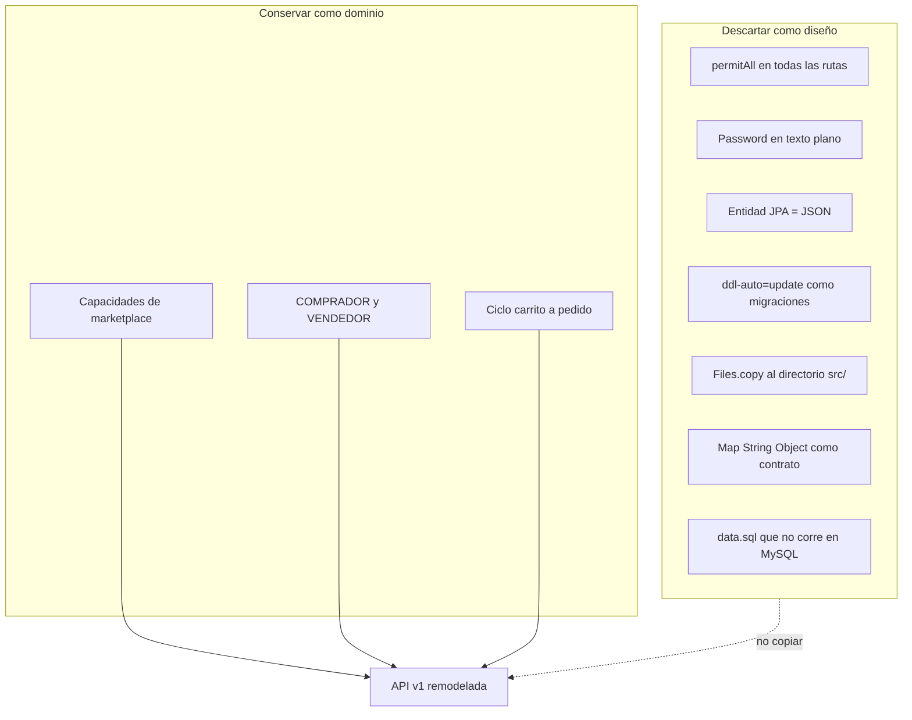

# 00 — Estado actual obsoleto

El código bajo `src/main/java` es un **prototipo de API REST reducido al núcleo comercial** (guía). Los módulos inacabados se eliminaron; ver [09-NUCLEO-GUIA.md](09-NUCLEO-GUIA.md). No es un producto ni el diseño destino.

## Declaración

Se ocupa:

1. **Remodelación** — el contrato HTTP (DTOs, auth, errores, paginación) no es el de una API pública.
2. **Reestructura** — paquetes planos `controller/service/repository/model` mezclan todos los bounded contexts.
3. **Nuevo planteamiento** — o se pasa a un monolito modular con la misma API versionada, o se cambia de enfoque/stack (docs 06 y 07). En ambos casos el destino **no** es más CRUD sobre entidades JPA.

## Qué se conserva como valor

- El **mapa de capacidades**: catálogo, carrito, pedido, cupón, reseña, favorito, dirección, preorden, notificación, blog, evento, métricas, imágenes.
- El **núcleo comercial**: `Usuario → Producto → Carritoitem → Pedido`.
- Los **roles** COMPRADOR / VENDEDOR.
- Swagger como idea (no la versión 2.1.0 concreta).

## Qué se descarta como diseño

## Criterio: “obsoleto” no significa “borrar mañana”

El prototipo se puede arrancar (`./mvnw spring-boot:run`) para contrastar comportamientos. Cada endpoint nuevo o reescrito debe **dejar de depender** de:

- IDs de usuario en la URL como única autorización
- `PasswordEncoder` sin usar
- `FetchType.EAGER` serializado al cliente
- Scripts SQL huérfanos

Si una decisión (seguir en Spring vs. cambiar de stack) aún no está tomada, usar [06-CAMBIO-DE-ENFOQUE.md](06-CAMBIO-DE-ENFOQUE.md) y [07-CAMBIO-DE-STACK.md](07-CAMBIO-DE-STACK.md) **antes** de mover paquetes Java.
