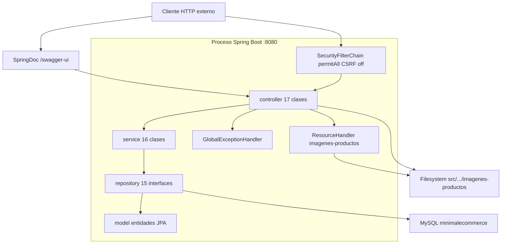
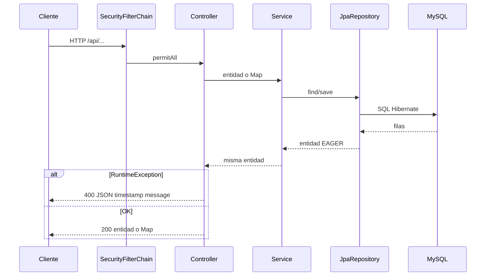
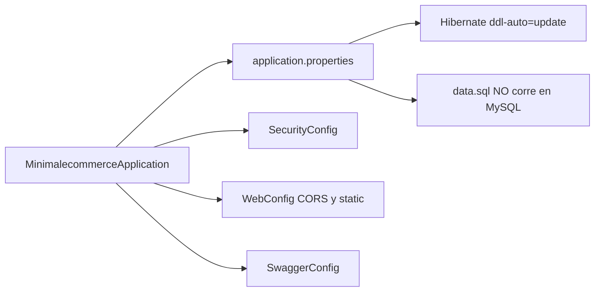
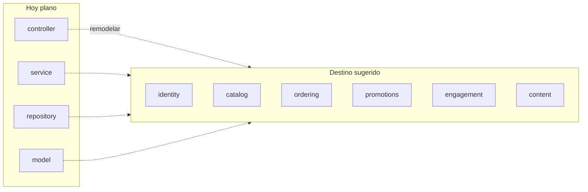

# 01 — Arquitectura actual de la API

Vista del **prototipo obsoleto**: un proceso Spring Boot, un módulo Maven, Tomcat embebido, MySQL local.

## Capas

No hay API Gateway, ni capa de DTOs, ni cola, ni caché. El JSON de salida **es** el grafo Hibernate.

## Ciclo de un request típico

## Arranque y configuración

Puntos de fricción:

- CORS duplicado (`WebConfig` vs `spring.web.cors.*`).
- `spring.sql.init.mode=embedded` deja el seed inerte.
- OpenAPI 2.1.0 sobre Boot 3.5.0 (combinación desactualizada).
- Vistas HTML configuradas (`spring.mvc.view.prefix`) sin archivos.

## Paquetes Java actuales vs. destino

El destino (módulos) se detalla en [06-CAMBIO-DE-ENFOQUE.md](06-CAMBIO-DE-ENFOQUE.md). No es obligatorio si se cambia de stack; el **contrato** sí: [05-CONTRATO-API.md](05-CONTRATO-API.md).
