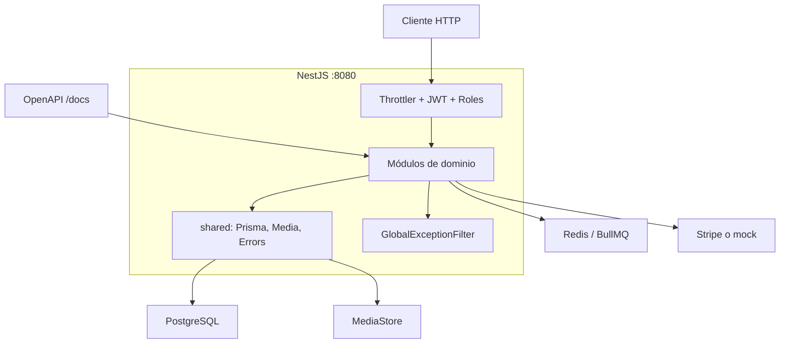
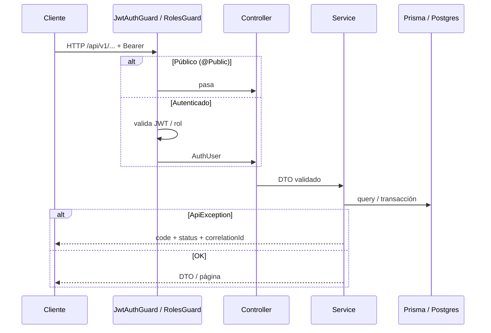
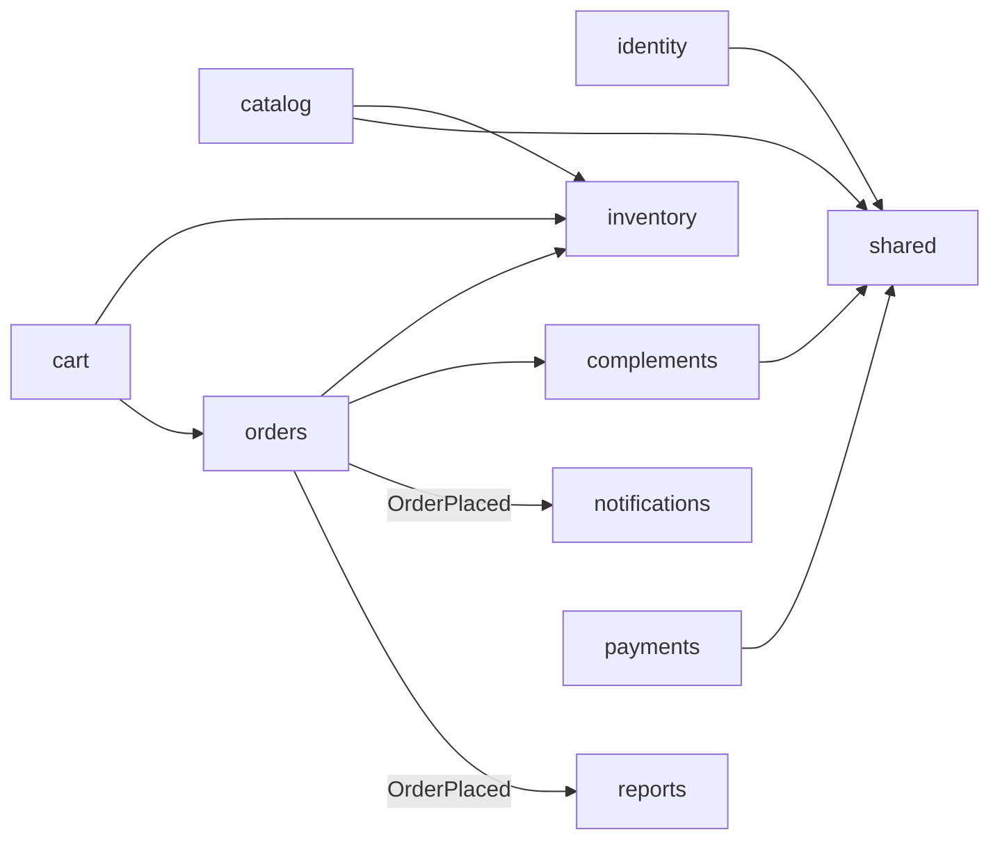

# 01 — Arquitectura de la API

Monolito modular NestJS: **un deploy**, varios módulos de dominio. Sin microservicios ni frontend en este repositorio.

## Stack

| Área | Tecnología |
|---|---|
| Runtime | NestJS 11 + TypeScript (strict) |
| Paquetes | pnpm workspace (`apps/api`) |
| BD | PostgreSQL (Supabase o contenedor local) |
| ORM | Prisma (migraciones versionadas) |
| Auth | Passport JWT + Argon2 + RBAC |
| Caché | `@nestjs/cache-manager` (lecturas de catálogo) |
| Colas | Redis + BullMQ (notificaciones) |
| Eventos | `@nestjs/event-emitter` (`OrderPlaced`) |
| Media | Supabase Storage o filesystem local |
| Pagos | Adaptador propio → Stripe (sandbox / mock) |
| Ops | Helmet, CORS, throttler, Pino, correlation-id, OpenAPI |

## Vista del proceso

## Ciclo de un request

## Módulos y dependencias

- **Núcleo comercial:** identity, catalog, inventory, cart, orders, payments.
- **Async / proyección:** notifications, reports.
- **Complementos (feature flags):** cupones, reseñas, favoritos, blog, eventos.

Detalle de carpetas: [06-ESTRUCTURA.md](06-ESTRUCTURA.md).
