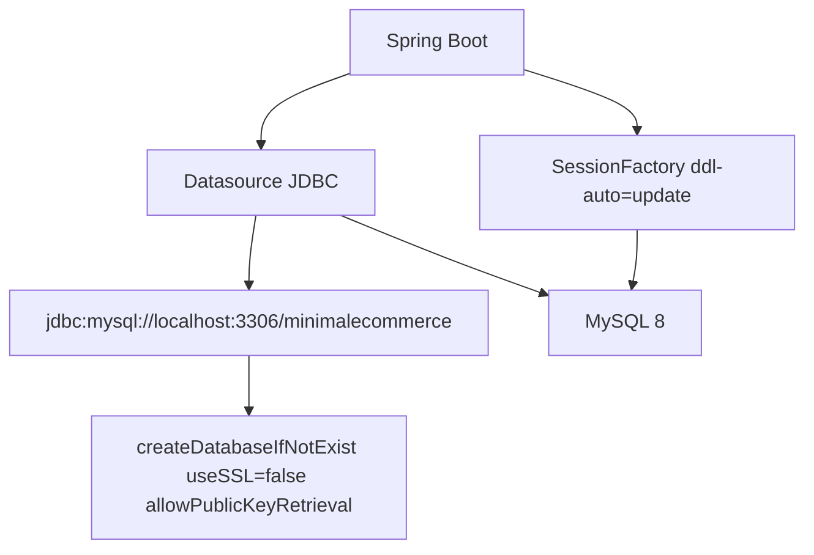
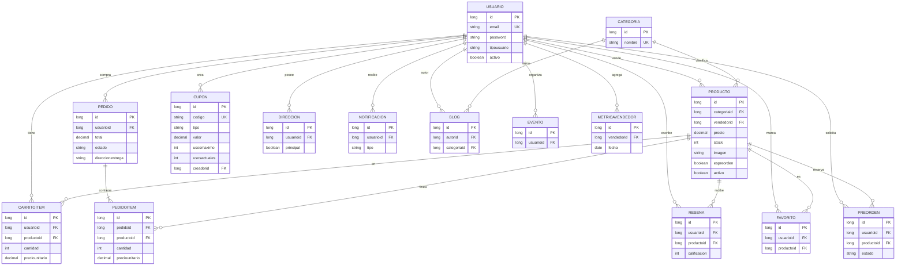
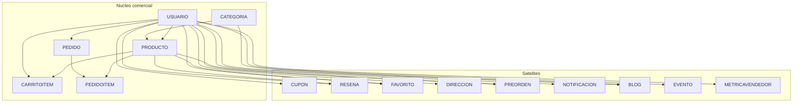

# 02 — Modelo de datos y conexión a MySQL

Hibernate es el dueño del esquema (`ddl-auto=update`). No hay Flyway. Las tablas se llaman como las entidades, en minúsculas.

## Conexión actual

Credenciales: `spring.datasource.username` / `password` en `application.properties` (secretos en git). Driver: `mysql-connector-j`.

## Diagrama entidad-relación (prototipo)

## Núcleo vs. satélites

## Fetch y serialización

Casi todas las `@ManyToOne` son `EAGER`. Un GET de carrito arrastra producto, categoría, vendedor (usuario con password). `Cupon.creador` es la excepción (`LAZY` + `@JsonIgnore`).

En la API remodelada: entidades **no** salen por HTTP; el modelo de persistencia puede seguir parecido, el contrato no.

## Seed

| Script | Intención | Realidad |
|---|---|---|
| `data.sql` | Categorías + 3 usuarios | No corre (`init.mode=embedded`) |
| `data-nuevas-tablas.sql` | Pedido dummy total 0 | Manual |
| `data-nuevas-3-tablas.sql` | Eventos y blogs | Manual |

Cualquier stack nuevo debe sustituir esto por migraciones versionadas + seed de desarrollo explícito.
