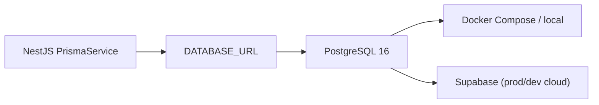
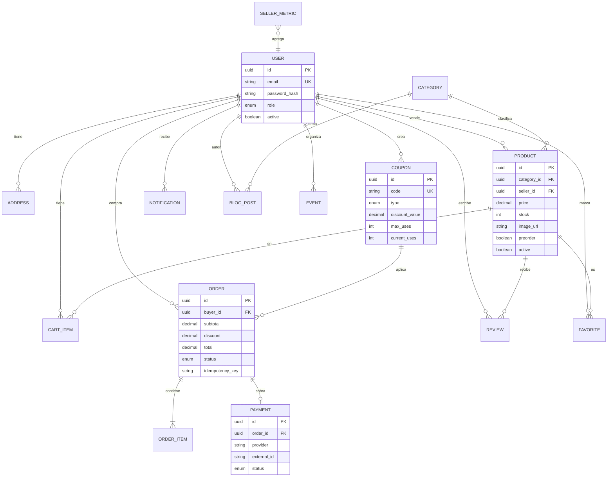
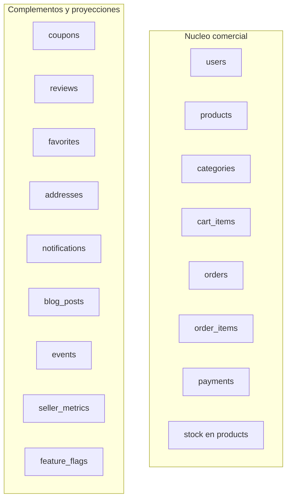

# 02 — Modelo de datos

Fuente de verdad: [`apps/api/prisma/schema.prisma`](../apps/api/prisma/schema.prisma).
Migraciones en `apps/api/prisma/migrations/`. IDs: **UUID**. Contraseñas: solo `password_hash` (nunca en respuestas).

## Conexión

Variables: ver `.env.example` (`DATABASE_URL`). RLS está habilitado en tablas sensibles como segunda barrera; la API conecta con rol de aplicación.

## Diagrama entidad-relación

## Enums relevantes

| Enum | Valores |
|---|---|
| `UserRole` | `COMPRADOR`, `VENDEDOR`, `SUPERADMIN` |
| `OrderStatus` | `PENDIENTE_PAGO`, `PAGADO`, `PENDIENTE`, `CONFIRMADO`, `ENVIADO`, `ENTREGADO`, `CANCELADO` |
| `CouponType` | `PORCENTAJE`, `MONTO_FIJO` |
| `PaymentStatus` | `PENDING`, `SUCCEEDED`, `FAILED`, `CANCELED` |
| `NotificationType` | `PEDIDO`, `STOCK`, `PROMOCION`, `SISTEMA`, `PAGO` |

## Núcleo vs satélites

## Seed

`pnpm --filter api exec prisma db seed` crea usuarios demo, categoría, producto, cupón `WELCOME10` y feature flags activos. Detalle en [07-DESARROLLO.md](07-DESARROLLO.md).
