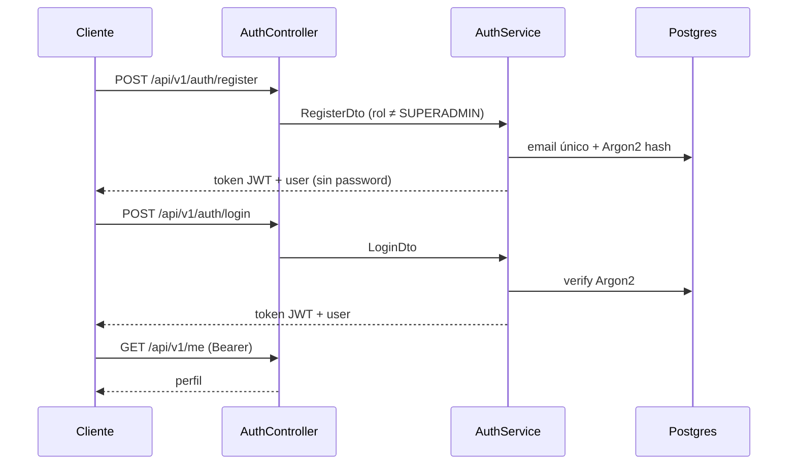
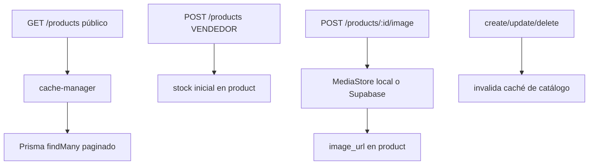
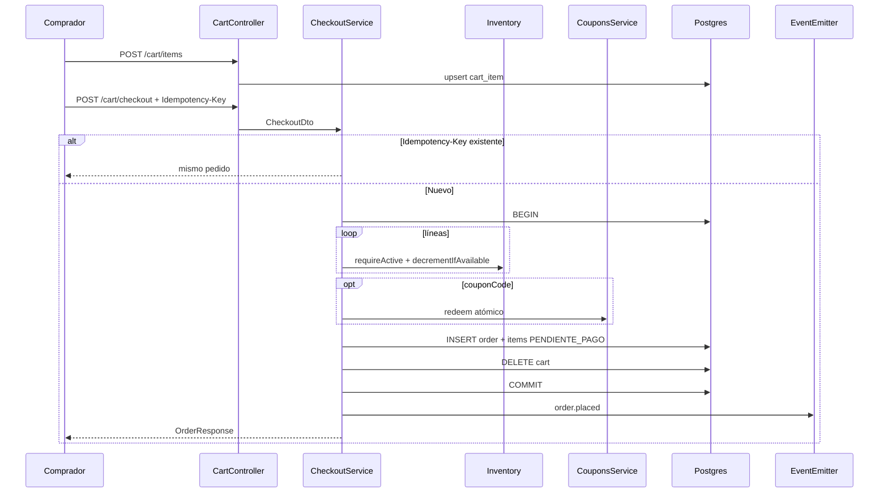
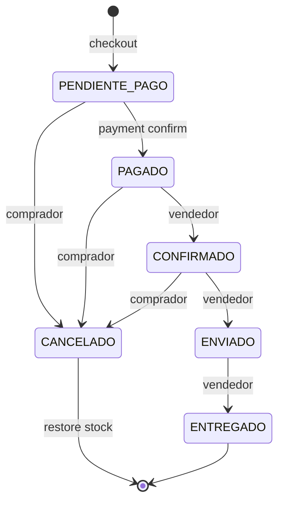
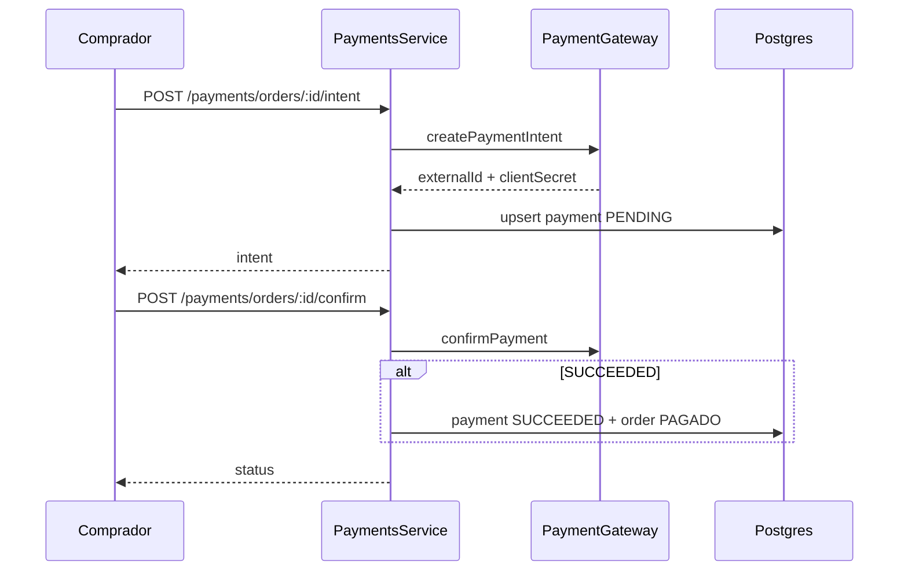
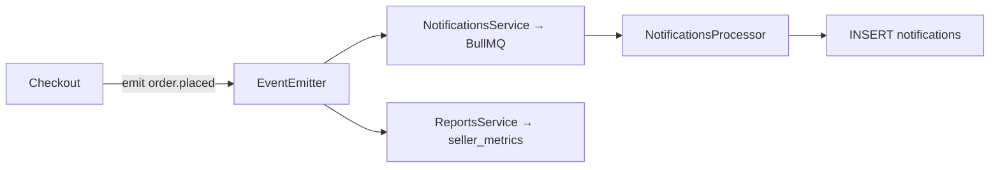

# 03 — Flujos

Flujos implementados hoy en NestJS. El sujeto autenticado sale del JWT (`AuthUser.userId`).

## Autenticación

Un solo registro y un solo login.

Roles: `COMPRADOR`, `VENDEDOR`, `SUPERADMIN`. Endpoints mutadores usan `RolesGuard`.

## Catálogo e inventario

Stock se decrementa solo en checkout (`InventoryService.decrementIfAvailable` con `UPDATE … WHERE stock >= qty`).

## Carrito y checkout

Estados de pedido:

## Pagos

Sin `STRIPE_SECRET_KEY` el gateway usa mock local (útil en e2e).

## Eventos post-pedido

El checkout **no espera** a Redis/BullMQ para responder; las notificaciones son asíncronas.

## Cupones y feature flags

- Crear cupón: `POST /coupons` (vendedor / superadmin).
- Aplicar: solo dentro del checkout (`redeem` incrementa `current_uses`).
- Reseñas, favoritos, blog y eventos consultan `feature_flags` antes de operar.
