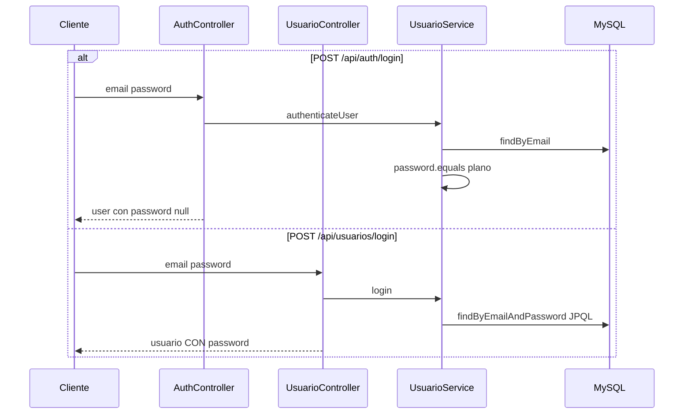
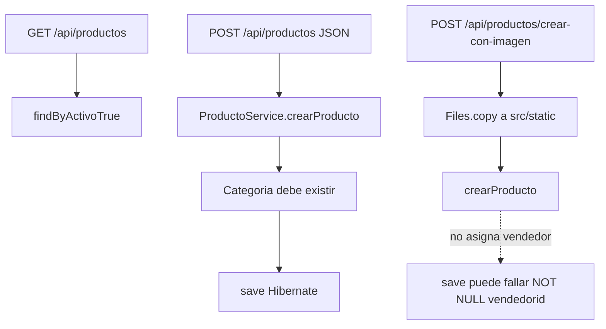
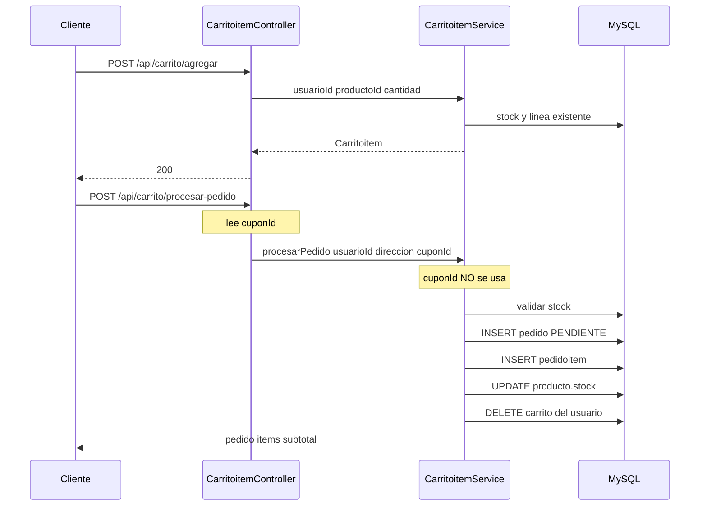
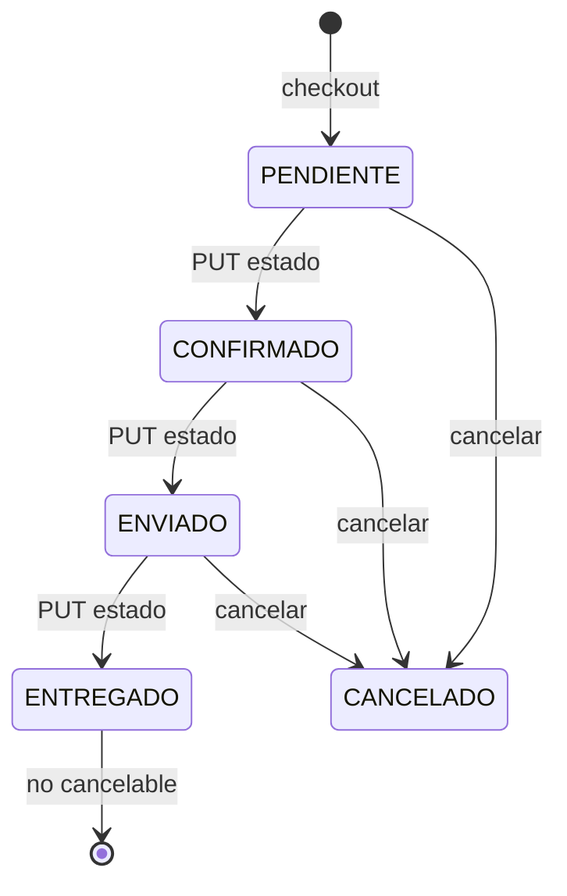
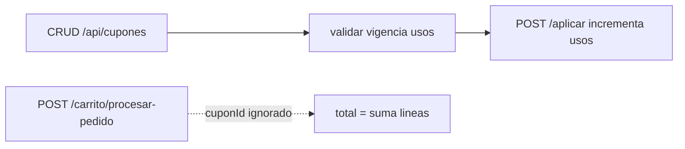
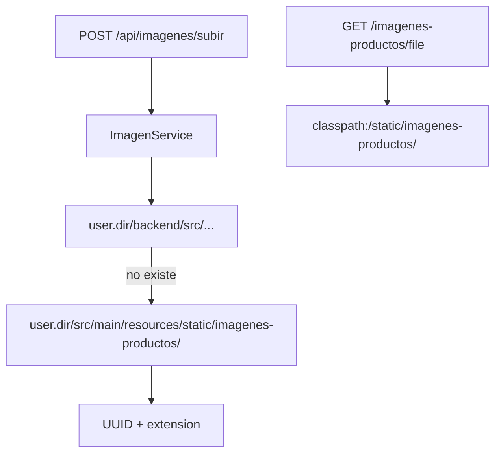
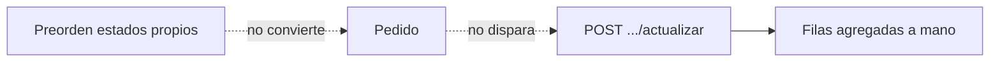

# 03 — Flujos actuales de la API

Flujos del prototipo. Los huecos (líneas punteadas) son parte de la obsolescencia.

## Autenticación (insegura)

Hay **dos** logins incompatibles.

No hay token. El cliente reenvía `usuarioId` en cada llamada. Cualquiera puede usar el id de otro.

## Catálogo y alta con imagen

## Carrito y checkout (core)

No hay estado de pago. El cambio de estado no comprueba que el llamador sea el vendedor del SKU.

## Cupón (módulo huérfano respecto al cobro)

## Imágenes

Subida y lectura no comparten garantía de path; en un JAR la escritura al árbol `src/` no aplica.

## Preorden y métricas (desconectadas del core)

Estos flujos son el mapa a **rediseñar** (eventos de dominio `OrderPlaced`, conversión preorden→pedido, proyección de métricas), no a copiar línea a línea. Plan: [08-PLAN-REMODELACION.md](08-PLAN-REMODELACION.md).
