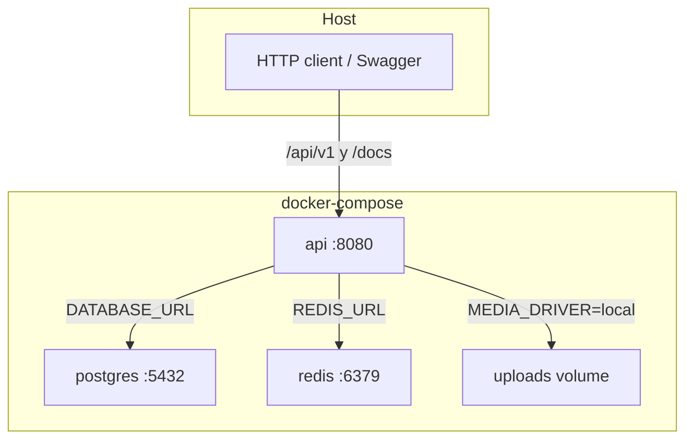
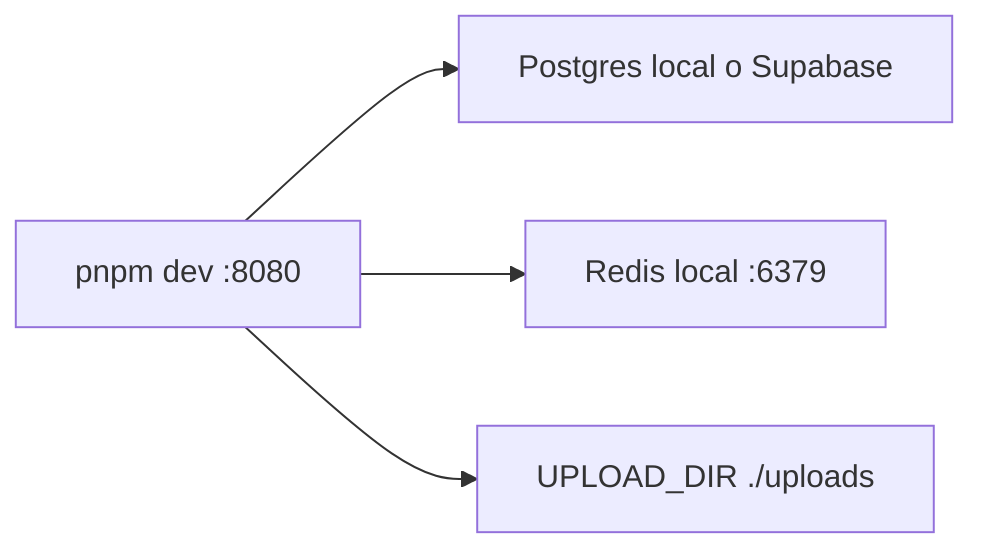
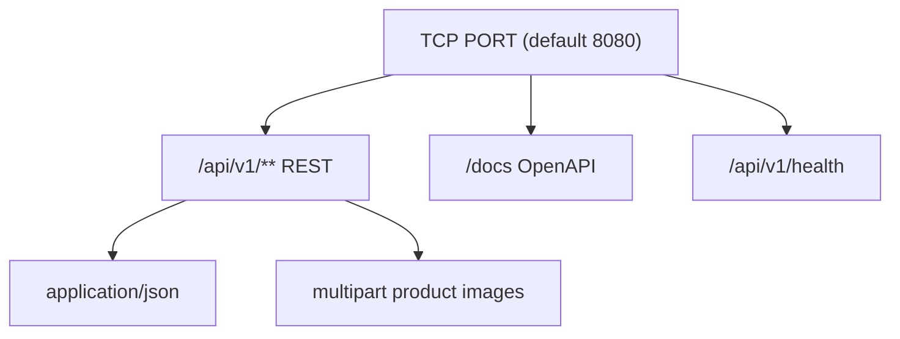
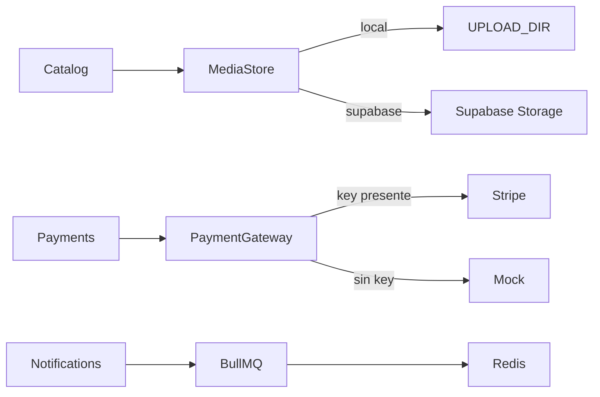
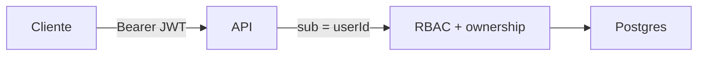

# 04 — Conexiones

Cómo se conectan cliente, API, base de datos, colas y servicios externos.

## Despliegue local (Docker Compose)

Servicios definidos en [`docker-compose.yml`](../docker-compose.yml). Healthchecks en Postgres y Redis antes de levantar la API.

## Sin Docker

## Superficie de red

Protecciones activas: Helmet, CORS (`CORS_ORIGINS`), `@nestjs/throttler`, JWT global (excepto `@Public()`).

## Integraciones opcionales

| Variable | Uso |
|---|---|
| `SUPABASE_URL` + `SUPABASE_SERVICE_ROLE_KEY` | Storage cuando `MEDIA_DRIVER=supabase` |
| `SUPABASE_STORAGE_BUCKET` | Bucket de imágenes (default `product-images`) |
| `STRIPE_SECRET_KEY` | PaymentIntents reales; si vacío → mock |
| `STRIPE_WEBHOOK_SECRET` | Reservado para webhooks (sandbox) |
| `REDIS_URL` | BullMQ (notificaciones) |

## Confianza

El cliente **no** elige el `usuarioId` en la URL para autorizar: lo emite el servidor tras autenticar. Vendedor solo muta sus productos; comprador solo su carrito/pedidos.
