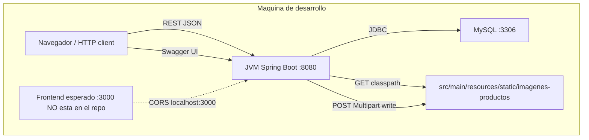
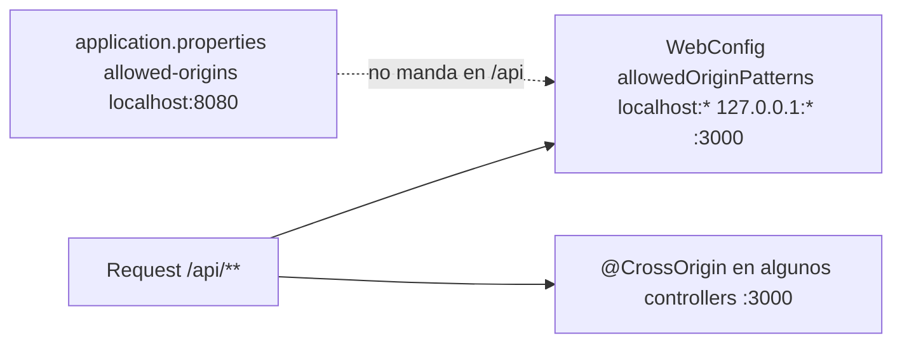
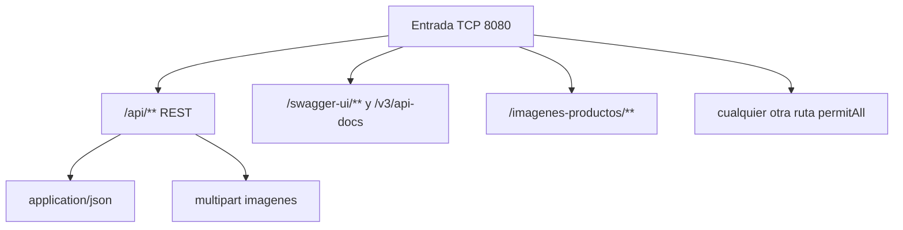
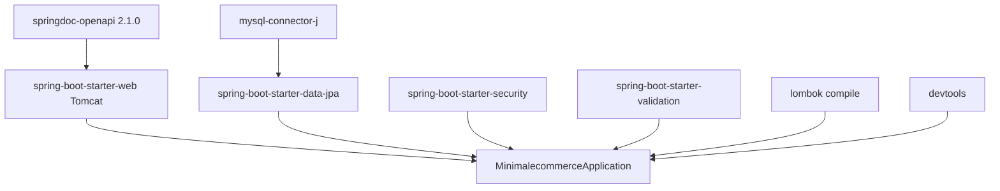
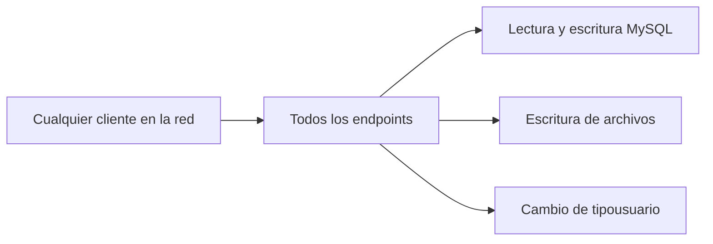

# 04 — Conexiones del sistema actual

Cómo se conectan cliente, API, base de datos y archivos en el prototipo.

## Mapa de despliegue local

No hay reverse proxy, TLS, ni red Docker. Un `docker-compose` no existe.

## CORS y orígenes

En la remodelación: **un** sitio de CORS, lista de orígenes por perfil.

## Superficie de red de la API

Todo es público. No hay rate limit ni API key.

## Dependencias de runtime

Ausentes: Redis, broker, cliente HTTP de pagos, S3 SDK, Flyway, JWT library (jjwt/nimbus).

## Confianza (modelo de amenaza actual)

Eso es inaceptable fuera de localhost. Cualquier stack o enfoque nuevo debe invertir este diagrama: el cliente **no** elige el `usuarioId`; lo emite el servidor tras autenticar.
