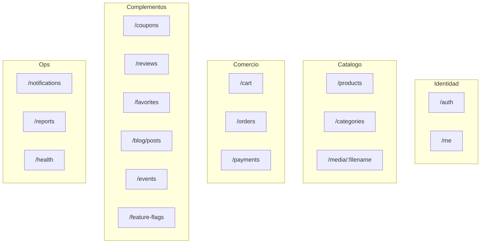

# 05 — Contrato HTTP

Prefijo: **`/api/v1`**. OpenAPI vivo: [`/docs`](http://localhost:8080/docs).
Sujeto = claim `sub` del JWT. Respuestas y bodies son DTOs (nunca modelos Prisma).

## Agrupación por capacidad



## Endpoints principales

| Método | Ruta | Auth | Notas |
|---|---|---|---|
| `POST` | `/auth/register` | público | Roles `COMPRADOR` \| `VENDEDOR` |
| `POST` | `/auth/login` | público | Devuelve Bearer JWT |
| `GET/PUT` | `/me` | JWT | Perfil |
| `GET/POST/DELETE` | `/me/addresses` | JWT | Direcciones |
| `GET` | `/categories`, `/products` | público | Productos paginados |
| `POST/PUT/DELETE` | `/products` | VENDEDOR+ | Mutación + invalidación de caché |
| `POST` | `/products/:id/image` | VENDEDOR | multipart `file` |
| `GET/POST/PUT/DELETE` | `/cart`, `/cart/items` | JWT | Carrito del sujeto |
| `POST` | `/cart/checkout` | JWT | Header opcional `Idempotency-Key` |
| `GET` | `/orders`, `/orders/sold`, `/orders/:id` | JWT | Buyer / seller |
| `PUT` | `/orders/:id/status` | VENDEDOR | Cumplimiento |
| `POST` | `/orders/:id/cancel` | comprador | Restaura stock |
| `POST` | `/payments/orders/:id/intent` | JWT | Crea PaymentIntent |
| `POST` | `/payments/orders/:id/confirm` | JWT | Marca `PAGADO` |
| `POST/GET` | `/coupons` | VENDEDOR+ / público | Crear / consultar código |
| `POST/GET` | `/reviews` | COMPRADOR / público | Feature flag `reviews` |
| `GET/POST/DELETE` | `/favorites` | COMPRADOR | Feature flag `favorites` |
| `GET/POST` | `/blog/posts`, `/events` | mixto | Feature flags |
| `GET/PUT` | `/feature-flags` | SUPERADMIN | Activar módulos |
| `GET` | `/notifications` | JWT | Lista del usuario |
| `GET` | `/reports/seller`, `/platform` | VENDEDOR / SUPERADMIN | Métricas |
| `GET` | `/health` | público | `SELECT 1` |

## Errores

```json
{
  "code": "STOCK_INSUFFICIENT",
  "message": "No hay stock suficiente",
  "details": [],
  "timestamp": "2026-08-27T01:00:00.000Z",
  "path": "/api/v1/cart/checkout",
  "correlationId": "…"
}
```

Status habituales: `400` validación / regla de negocio, `401` sin token, `403` rol, `404` recurso, `409` conflicto (stock, cupón, email).

## Paginación

Listados de productos y pedidos:

```json
{
  "content": [],
  "page": 0,
  "size": 20,
  "totalElements": 0,
  "totalPages": 0
}
```

## Idempotencia

`POST /cart/checkout` acepta `Idempotency-Key`. Misma clave + mismo comprador → mismo pedido (unique `(buyer_id, idempotency_key)`).
