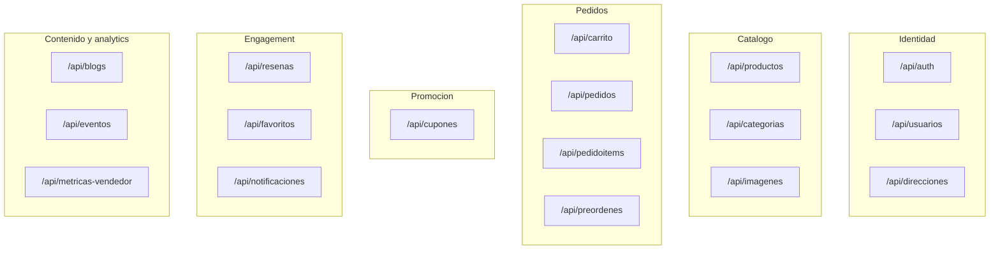
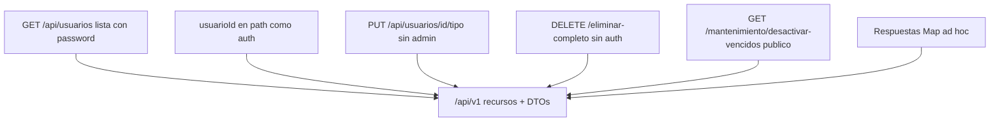

# 05 — Contrato HTTP actual (superficie de la API)

Este es el **producto** que hay que remodelar: una API REST bajo `/api`. El frontend no está; quien consuma esto (ahora o después de un cambio de stack) necesita este mapa.

Convenciones rotas hoy: entidades JPA como body, `Map<String,Object>`, login duplicado, sin `/v1`, sin paginación, sin auth.

## Agrupación por capacidad

## Qué preservar semánticamente

| Capacidad | Endpoints clave | Al remodelar |
|---|---|---|
| Registro | `POST /api/usuarios/registro`, `/registro/vendedor` | Un registro; rol en claim o tabla; password hash |
| Login | dos rutas | **Una** + JWT |
| Catálogo | `GET /api/productos`, filtros, por vendedor | DTOs + `Pageable` |
| Carrito | `/agregar`, cantidad, limpiar | Sujeto = token |
| Checkout | `POST /api/carrito/procesar-pedido` | Cupón real, idempotencia, stock atómico |
| Pedidos | por usuario / vendedor / estado | Autorización por rol |
| Cupones | CRUD + validar + aplicar | Aplicar **dentro** del checkout |
| Reseñas / favoritos / direcciones | CRUD existente | DTOs, ownership |
| Media | `/api/imagenes` | Object storage; URL pública |

Lista exhaustiva de métodos: [DOCUMENTACION.md](../DOCUMENTACION.md) sección 7.

## Qué no preservar como contrato

## Forma objetivo del contrato (independiente del stack)

- Prefijo `/api/v1`.
- Recursos en plural, IDs opacos o UUID.
- Errores: `{ code, message, details }` y status correctos (404/409/401/403).
- OpenAPI generado y publicado; SpringDoc o equivalente en otro runtime.
- Compatibilidad: el prototipo `/api/**` se puede dejar un tiempo como *legacy* y apagar cuando el cliente nuevo exista.

Si se cambia de stack, **este archivo + OpenAPI nuevo** son el brief de migración, no las clases Java.
