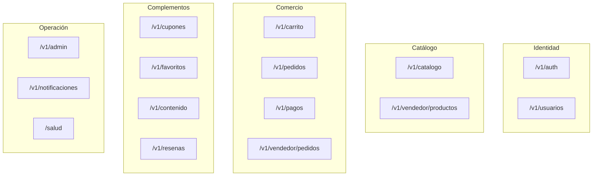

# 05 — Contrato HTTP (MinimalShop)

- **Prefijo:** `/api`
- **Versión:** URI `v1` → rutas de negocio `/api/v1/...`
- **OpenAPI:** `/docs` (si `SWAGGER_ENABLED=true`)
- **Autenticación:** `Authorization: Bearer <accessToken>` salvo rutas `@Publico`
- **Errores:** JSON con `code`, `message`, `details`, `timestamp`, `path`, `correlationId`
- **Integración frontend:** ver [GUIA-FRONTEND.md](./GUIA-FRONTEND.md)

## Mapa de capacidades

```mermaid
flowchart TB
  subgraph identity [Identidad]
    Auth["/v1/auth"]
    Usr["/v1/usuarios"]
  end
  subgraph catalog [Catálogo]
    Cat["/v1/catalogo"]
    VenP["/v1/vendedor/productos"]
  end
  subgraph commerce [Comercio]
    Cart["/v1/carrito"]
    Ord["/v1/pedidos"]
    Pay["/v1/pagos"]
    VenO["/v1/vendedor/pedidos"]
  end
  subgraph comp [Complementos]
    Cup["/v1/cupones"]
    Fav["/v1/favoritos"]
    Cont["/v1/contenido"]
    Res["/v1/resenas"]
  end
  subgraph ops [Operación]
    Adm["/v1/admin"]
    Notif["/v1/notificaciones"]
    Salud["/salud"]
  end
```

## Endpoints principales

### Auth e identidad

| Método | Ruta | Auth | Notas |
|--------|------|------|-------|
| POST | `/v1/auth/registro` | público | `rol`: `COMPRADOR` \| `VENDEDOR` |
| POST | `/v1/auth/ingreso` | público | Sesión con tokens |
| POST | `/v1/auth/refrescar` | público | Rotación refresh |
| POST | `/v1/auth/salir` | público | Revoca refresh |
| GET/PATCH | `/v1/usuarios/yo` | JWT | Perfil |
| GET/POST/DELETE | `/v1/usuarios/yo/direcciones` | JWT | Direcciones |
| GET/PATCH | `/v1/admin/usuarios` | SUPERADMIN | Admin usuarios |

### Catálogo

| Método | Ruta | Auth | Notas |
|--------|------|------|-------|
| GET | `/v1/catalogo/productos` | público | Paginado, filtros `q`, `categoriaId`, `orden` |
| GET | `/v1/catalogo/productos/:id` | público | Detalle |
| GET | `/v1/catalogo/productos/:id/resenas` | público | Módulo `resenas` |
| GET | `/v1/catalogo/categorias` | público | Listado |
| GET/POST/PATCH | `/v1/vendedor/productos` | VENDEDOR | CRUD |
| POST | `/v1/vendedor/productos/:id/publicar` | VENDEDOR | |
| PUT | `/v1/vendedor/productos/:id/imagen` | VENDEDOR | multipart `archivo` |
| PUT | `/v1/vendedor/productos/:id/existencias` | VENDEDOR | |
| POST/PATCH/DELETE | `/v1/admin/categorias` | SUPERADMIN | |

### Carrito y pedidos

| Método | Ruta | Auth | Notas |
|--------|------|------|-------|
| GET/DELETE | `/v1/carrito` | COMPRADOR | |
| POST/PUT/DELETE | `/v1/carrito/items` | COMPRADOR | |
| POST | `/v1/pedidos` | COMPRADOR | Header **`Idempotency-Key`** obligatorio |
| GET | `/v1/pedidos`, `/v1/pedidos/:id` | JWT | Comprador o involucrado |
| POST | `/v1/pedidos/:id/cancelar` | COMPRADOR | |
| POST | `/v1/pedidos/:id/recibido` | COMPRADOR | `ENVIADO` → `ENTREGADO` |
| GET | `/v1/vendedor/pedidos` | VENDEDOR | Paginado |
| PATCH | `/v1/vendedor/pedidos/:id/estado` | VENDEDOR | CU-09 |

### Pagos

| Método | Ruta | Auth | Notas |
|--------|------|------|-------|
| POST | `/v1/pagos/pedidos/:id/intento` | COMPRADOR | Crea intento; sin confirm cliente |
| GET | `/v1/pagos/pedidos/:id` | JWT | Estado del pago |
| POST | `/v1/pagos/webhook` | público | Cuerpo crudo Stripe |
| POST | `/v1/pagos/simulador/pedidos/:id/aprobar` | SUPERADMIN | Solo `mock` + no producción |
| POST | `/v1/pagos/simulador/pedidos/:id/rechazar` | SUPERADMIN | Idem |

### Complementos y ops

| Método | Ruta | Auth | Módulo |
|--------|------|------|--------|
| GET/POST | `/v1/vendedor/cupones` | VENDEDOR | cupones |
| GET | `/v1/cupones/:codigo` | público | cupones |
| GET/POST/DELETE | `/v1/favoritos` | COMPRADOR | favoritos |
| GET/POST | `/v1/contenido/publicaciones`, `/eventos` | mixto | contenido |
| POST/DELETE | `/v1/resenas` | COMPRADOR | resenas |
| GET/PATCH | `/v1/notificaciones` | JWT | notificaciones |
| GET | `/v1/vendedor/metricas` | VENDEDOR | reportes |
| GET | `/v1/admin/reportes/plataforma`, `/ventas` | SUPERADMIN | |
| GET/PATCH | `/v1/admin/modulos` | SUPERADMIN | registro módulos |
| GET | `/v1/medios/:clave` | público | Solo driver local |
| GET | `/salud/vida`, `/salud/listo` | público | Terminus |

## Ciclo de vida del pedido

`CREADO` → `PENDIENTE_PAGO` → `PAGADO` → `EN_PREPARACION` → `ENVIADO` → `ENTREGADO`  
Estados terminales: `CANCELADO`, `REEMBOLSADO`.

## Códigos de error (selección)

Ver `apps/api/src/compartido/errores/codigos-error.ts`. Destacados: `STOCK_INSUFFICIENT`, `EMPTY_CART`, `IDEMPOTENCY_KEY_REQUIRED`, `MODULE_DISABLED`, `ORDER_NOT_PAYABLE`, `PAYMENT_PROVIDER_UNAVAILABLE`, `REVIEW_NOT_ALLOWED`.
