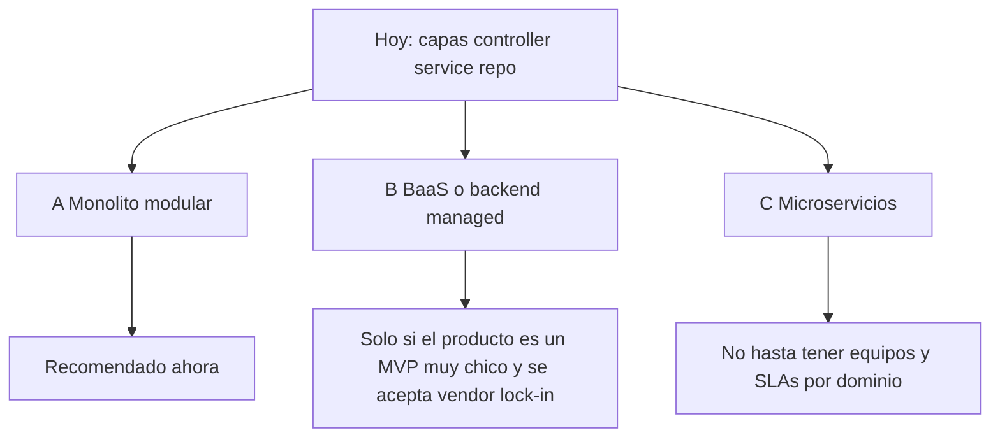
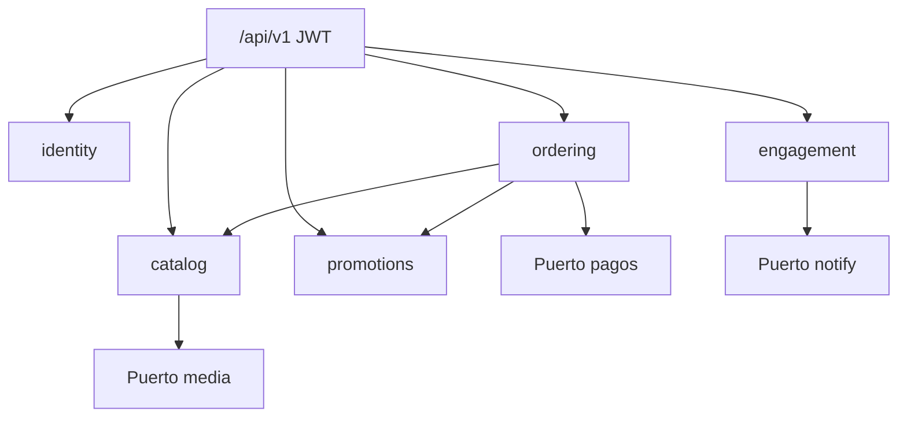
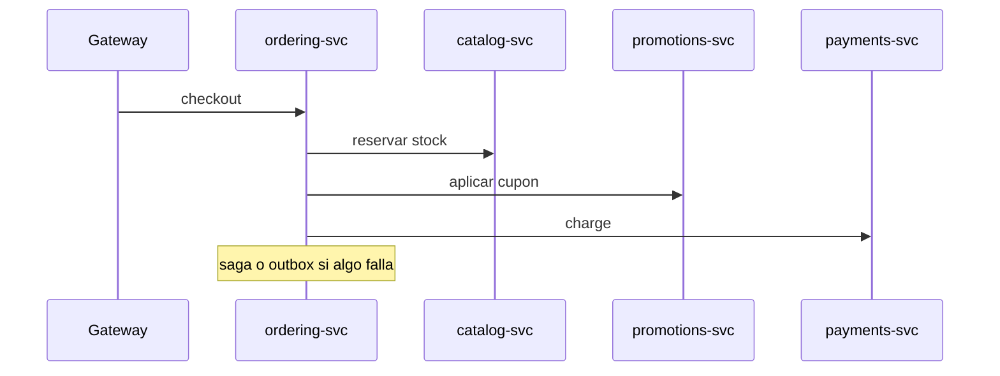
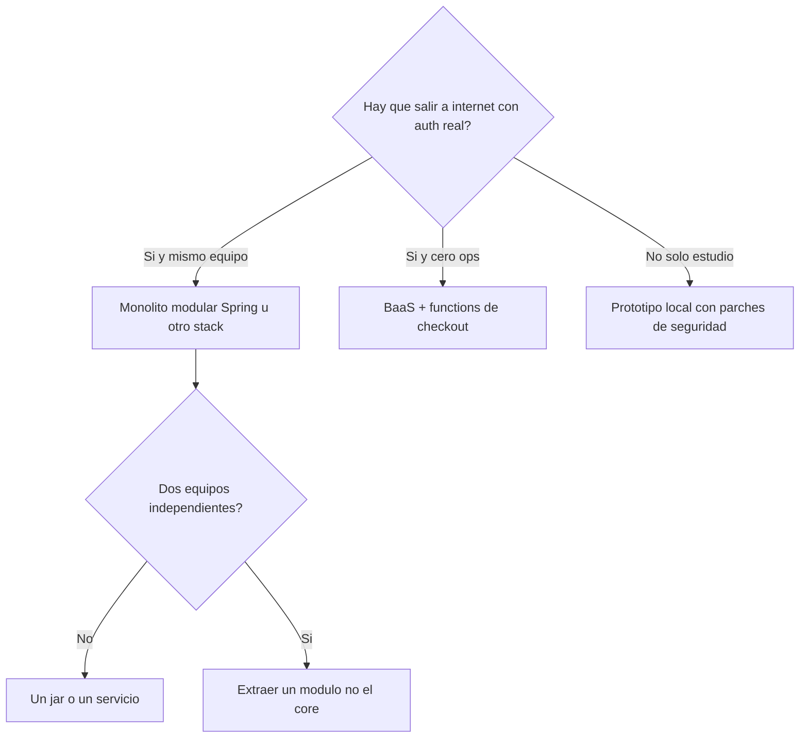

# 06 — Si se decide cambiar de enfoque

Usar este documento cuando el runtime (Java/Spring) **se mantiene o no es el debate**, pero el **estilo de sistema** sí.

El prototipo es un **CRUD anémico de un solo paquete**. Tres enfoques serios; uno se descarta a corto plazo.

## A — Monolito modular (recomendado si se sigue en este repo)

Un deploy, varios módulos de dominio, API HTTP única `/api/v1`.

| Módulo | Absorbe |
|---|---|
| `identity` | Usuario, auth, direcciones |
| `catalog` | Producto, categoría, media |
| `ordering` | Carrito, pedido, preorden |
| `promotions` | Cupón (puerto usado por ordering) |
| `engagement` | Reseña, favorito, notificación |
| `content` | Blog, evento (opcional / tardío) |
| `seller-analytics` | Proyección de métricas |

**Pros:** un artefacto, transacciones locales en checkout, refactor posible sobre el código actual.  
**Contras:** disciplina de paquetes; hay que dejar de importar entidades entre módulos a lo loco.

Criterios de éxito: [REESTRUCTURA.md](../REESTRUCTURA.md) sección 3.7.

## B — BaaS / backend managed

Supabase, Firebase, Appwrite, etc.: auth y Postgres/documentos hosted; la “API” es la del vendor + edge functions.

**Pros:** auth y storage resueltos rápido.  
**Contras:** el dominio de checkout/stock/cupones **no** cabe en reglas genéricas; se reescribe la lógica de `procesarPedido` en functions. El ER actual no se mapea 1:1.

Usar BaaS solo si se acepta **rediseñar** el contrato (doc 05) y no “subir el JPA a la nube”.

## C — Microservicios

Un proceso por módulo (`catalog-svc`, `order-svc`, …).

**No recomendado ahora:** un autor, un MySQL, checkout que toca cuatro tablas. El coste de sagas supera el beneficio. Extraer **después** si un módulo (p. ej. `content` o pagos) necesita escalar o un equipo propio.

## D — Enfoques que no conviene mezclar con el prototipo

| Idea | Por qué no pegarla encima de `src/` |
|---|---|
| GraphQL sobre las mismas entidades | Expone peor el grafo EAGER |
| Servir SPA desde `static/` | Ya hay config muerta de HTML |
| Event sourcing desde el día uno | El dominio ni siquiera tiene eventos |
| CQRS completo | Las métricas sí pueden ser proyección; el catálogo no necesita dos modelos aún |

## Cómo elegir

Detalle de oleadas si se elige A: [08-PLAN-REMODELACION.md](08-PLAN-REMODELACION.md). Si el stack también cambia, leer [07-CAMBIO-DE-STACK.md](07-CAMBIO-DE-STACK.md) **antes** de mover paquetes.
