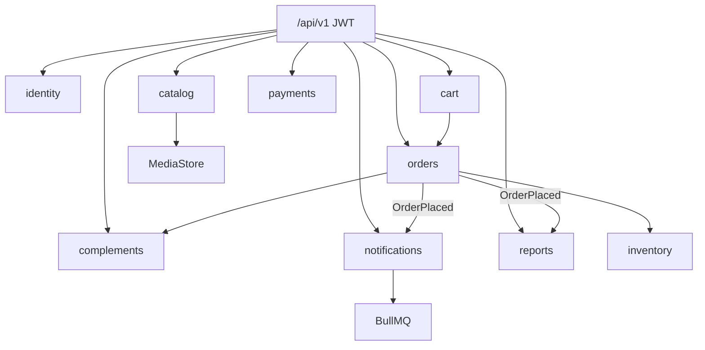

# 06 — Estructura del repositorio

```
.
├── package.json              # workspace pnpm (scripts raíz)
├── pnpm-workspace.yaml
├── pnpm-lock.yaml
├── Dockerfile
├── docker-compose.yml        # api + postgres + redis
├── .env.example
├── .github/workflows/ci.yml
├── README.md
├── CHANGELOG.md
├── CONTRIBUTING.md
├── docs/                     # esta documentación
└── apps/api/                 # aplicación NestJS
    ├── prisma/
    │   ├── schema.prisma
    │   ├── migrations/
    │   └── seed.ts
    ├── src/
    │   ├── main.ts
    │   ├── app.module.ts
    │   ├── shared/
    │   │   ├── auth/         # JWT, guards, decorators
    │   │   ├── errors/       # ApiException + filtro global
    │   │   ├── events/       # OrderPlacedEvent
    │   │   ├── health/
    │   │   ├── media/        # MediaStore local / Supabase
    │   │   └── prisma/
    │   └── modules/
    │       ├── identity/
    │       ├── catalog/
    │       ├── inventory/
    │       ├── cart/
    │       ├── orders/
    │       ├── payments/
    │       ├── notifications/
    │       ├── reports/
    │       └── complements/
    └── test/                 # e2e Jest + Supertest
```

## Interior de un módulo

```
*.module.ts
*.controller.ts   # rutas HTTP versionadas
*.service.ts      # casos de uso
dto/              # class-validator + Swagger
```

Adapters (pagos, media) viven junto al puerto o en `shared/`.

## Mapa de módulos



Media nunca se sirve ni escribe desde el árbol `src/`.
