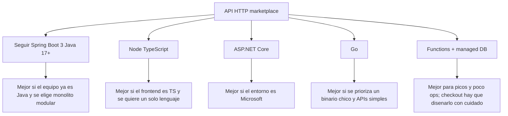
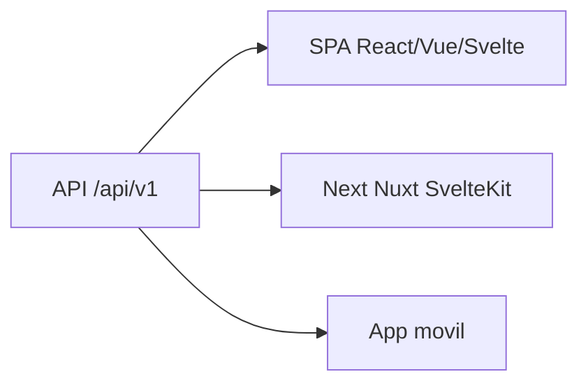
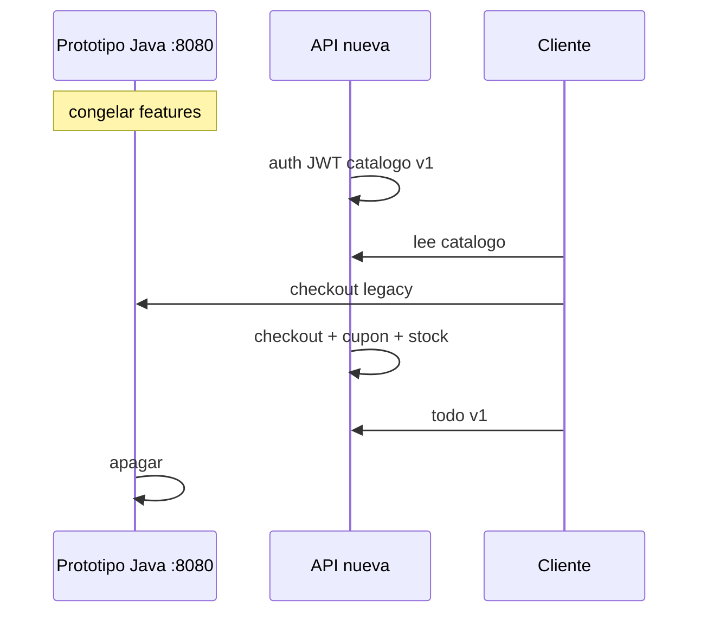

# 07 — Si se decide cambiar de stack tecnológico

Usar este documento cuando Java / Spring Boot **deja de ser** el runtime. El prototipo actual no se “traduce clase a clase”: se migra **dominio + contrato**, no Hibernate.

## Qué migrar (independiente del lenguaje)

1. Capacidades del [contrato](05-CONTRATO-API.md).
2. ER del [modelo](02-MODELO-DATOS.md) — se puede normalizar (UUID, `password_hash`, `orders.status` con pago).
3. Invariantes: stock no negativo, cupón con vigencia y usos, pedido no cancelable si `ENTREGADO`, vendedor dueño del SKU.
4. Roles COMPRADOR / VENDEDOR.
5. Datos demo (categorías, usuarios) — **no** las contraseñas planas.

## Qué no migrar

- `SecurityConfig.permitAll`
- `authenticateUser` con `equals`
- `ddl-auto=update` como proceso
- Paths `src/main/resources/static/...`
- `Map<String,Object>` y entidades en el JSON
- SpringDoc 2.1.0, Lombok, DevTools
- `target/` versionado

## Matriz de stacks candidatos

| Stack | Encaje con este dominio | Coste de migración | Riesgo en checkout/stock |
|---|---|---|---|
| Spring Boot 3 (remodelado) | Alto: el código ya está | Medio (paquetes, JWT, Flyway) | Bajo si se corrige transacción |
| NestJS / Fastify + Prisma | Alto en DX TS | Alto (reescritura) | Medio (transacciones Prisma) |
| Next.js Route Handlers + ORM | Alto si se unifica web+API | Alto | Medio (serverless + stock) |
| ASP.NET Core + EF | Alto | Alto | Bajo (transacciones maduras) |
| Go (chi/echo/fiber) + sqlc | Medio: más código a mano | Alto | Medio |
| Supabase / Firebase | Bajo-medio para pedidos | Alto (rediseño) | Alto si el stock queda en el cliente |
| Cloudflare Workers + D1/DO | Bajo para JPA-like | Alto | Alto (consistencia) |

Ningún stack nuevo justifica copiar `procesarPedido` ignorando el cupón.

## Mapeo conceptual Spring → otros

| Hoy | Nest/Prisma | ASP.NET | Go |
|---|---|---|---|
| `@RestController /api` | Controller + DTO | Minimal APIs / Controller | Handler + chi router |
| `@Service` | Injectable service | Application service | Package `service` |
| `JpaRepository` | Prisma client | `DbContext` | sqlc / pgx |
| Entidad `@Entity` | `schema.prisma` | EF entity | Struct + tags |
| `SecurityFilterChain` | Passport/JWT guard | ASP.NET Identity / JWT | middleware JWT |
| `ddl-auto` | Prisma migrate | EF migrations | golang-migrate / Flyway |
| SpringDoc | OpenAPI plugin | Swashbuckle / NSwag | oapi-codegen |
| Multipart a `src/` | S3/R2 + presign | Blob | S3 SDK |

## Frontend (siempre fuera de este prototipo)

El repo actual **no** tiene UI. Al cambiar de stack se puede:

No hace falta que el frontend y la API compartan lenguaje. Si se elige Next.js full-stack, el contrato 05 sigue valiendo como módulos de servidor; no se reutilizan los controladores Java.

## Criterios de decisión (preguntas)

1. ¿El equipo mantiene Java con soltura? → remodelar Spring (doc 06-A + 08).
2. ¿El único cliente será una app TypeScript y se quiere un solo repo? → Nest o Next; **nuevo** proyecto, este queda archivo.
3. ¿Hace falta el menor ops posible y el checkout puede ser simple? → BaaS; rediseñar stock.
4. ¿Hay restricción de cloud (Azure/AWS/GCP)? → dejar que eso elija runtime **después** del contrato, no al revés.

## Estrategia de corte

No ejecutar ambos checkouts en paralelo sobre la misma tabla de stock sin un solo dueño de escritura.

## Inventario de tecnologías actuales (para no reintroducirlas por inercia)

Java 17 · Maven Wrapper · Spring Boot 3.5.0 · Web · Data JPA · Security · Validation · mysql-connector-j · Lombok · SpringDoc 2.1.0 · DevTools · JUnit 5 · SQL seed · estáticos jpg/png/webp.

Si el nuevo stack las reemplaza, documentar el equivalente en el README nuevo y **no** dejar `application.properties` con secretos como plantilla.
