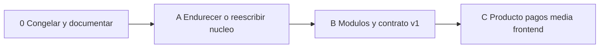
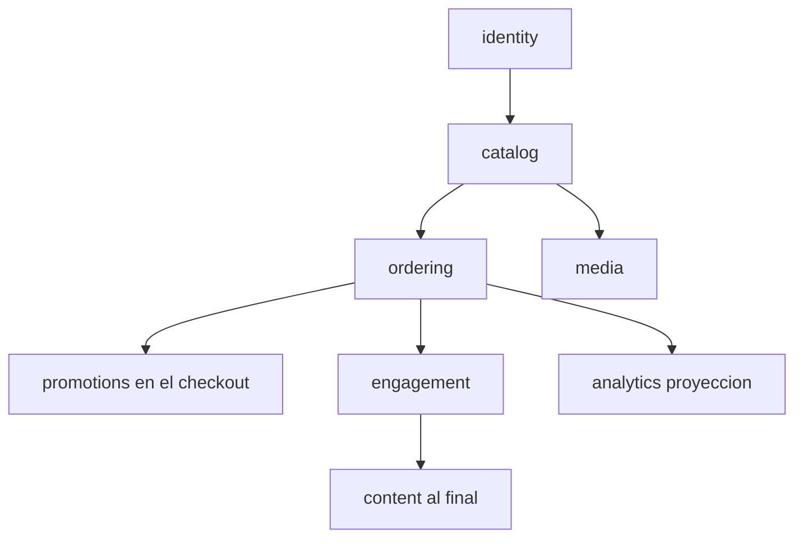

# 08 — Plan de remodelación

Secuencia para salir del prototipo obsoleto. Encaja con **seguir en Spring** (enfoque A). Si hay cambio de stack, las oleadas A/B se hacen en el runtime nuevo; la oleada 0 es la misma.

## Oleada 0 — ya hecha en documentación

- Declarar obsolescencia ([00](00-ESTADO-OBSOLETO.md)).
- Diagramar API, datos, flujos, conexiones ([01](01-ARQUITECTURA-API.md)–[04](04-CONEXIONES.md)).
- Fijar superficie HTTP ([05](05-CONTRATO-API.md)).
- Decidir enfoque ([06](06-CAMBIO-DE-ENFOQUE.md)) y stack ([07](07-CAMBIO-DE-STACK.md)) **antes** de mover miles de líneas.

**Puerta:** hay una decisión escrita (seguir Spring modular **o** runtime X). Sin eso no se reestructura `src/`.

## Oleada A — núcleo usable

Objetivo: un checkout honesto y una API que no sea un agujero.

- `.gitignore`, secretos fuera de git, perfiles.
- Auth: BCrypt + un login + JWT + RBAC.
- Flyway; apagar `ddl-auto=update` en todo lo que no sea sandbox.
- Cupón aplicado en la misma transacción que el pedido.
- Stock con `UPDATE ... WHERE stock >= :qty`.
- `vendedor` obligatorio al crear producto.
- Upload dir configurable (no `src/`).
- DTOs en auth, producto, carrito, pedido.
- Tests: checkout, stock insuficiente, cupón vencido, token ajeno.
- Docker Compose app + MySQL.

Si se **cambia de stack**, esta oleada es el primer vertical slice en el runtime nuevo, no un parche sobre las 74 clases.

## Oleada B — reestructura

- Paquetes/módulos `identity`, `catalog`, `ordering`, `promotions`, `engagement`.
- `/api/v1`; `/api` legacy opcional.
- Eventos internos `OrderPlaced` → métricas y notificaciones.
- Paginación, errores tipados, OpenAPI alineado.

## Oleada C — producto

- Puerto de pagos y estado `PENDIENTE_PAGO`.
- Object storage.
- Frontend desacoplado.
- Preorden → pedido al haber stock.
- CI (test + imagen).

## Orden de dominios (no alfabético)

Blog y eventos no determinan si esto es un e-commerce. No se remodelan primero.

## Relación con el código actual

Hasta que la oleada A exista en una rama de implementación, **`src/` permanece como archivo vivo del prototipo**. No se reorganizan paquetes “por estética” sin JWT ni DTOs: se duplica el desorden en carpetas nuevas.

Implementación de código = PRs posteriores a este paquete de documentación.
