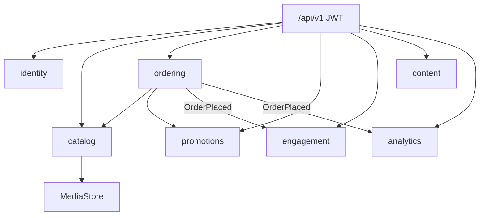

# 09 — Árbol de archivos (monolito modular)

La API vive en un solo artefacto Maven. Los paquetes son **módulos de dominio**, no capas técnicas globales.

```
.
├── pom.xml
├── Dockerfile
├── docker-compose.yml
├── .env.example
├── src/main/java/com/minimalecommerce/
│   ├── MinimalecommerceApplication.java
│   ├── shared/          # kernel: errores, JWT, media, eventos
│   ├── identity/        # usuarios, auth, direcciones
│   ├── catalog/         # productos, categorías, stock, media HTTP
│   ├── promotions/      # cupones (puerto del checkout)
│   ├── ordering/        # carrito, pedidos, preórdenes
│   ├── engagement/      # reseñas, favoritos, notificaciones
│   ├── content/         # blog, eventos
│   └── analytics/       # proyección de métricas de vendedor
├── src/main/resources/
│   ├── application.yml
│   ├── application-dev.yml
│   ├── application-docker.yml
│   └── db/migration/    # Flyway
└── src/test/            # H2 + MockMvc (checkout, auth, stock)
```

Cada módulo sigue el mismo interior:

```
api/           controladores HTTP + DTOs (records)
application/   casos de uso
domain/        entidades y enums (sin anotaciones web)
infrastructure/ repositorios JPA
```



Histórico del prototipo en capas: docs 00–08.
