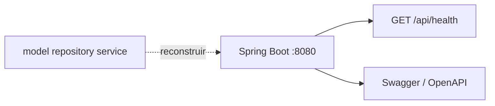

# 09 — Bases del proyecto (código vivo)

`src/` es solo el **esqueleto** de la API. No hay dominio de e-commerce en el árbol fuente.

## Qué hay

```
src/main/java/com/minimalecommerce/app/
  MinimalecommerceApplication.java
  config/       SecurityConfig, WebConfig, SwaggerConfig
  controller/   HealthController  →  GET /api/health
  exception/    GlobalExceptionHandler
src/main/resources/application.properties
src/test/.../MinimalecommerceApplicationTests.java
pom.xml · mvnw · .gitignore
```

Dependencias (sin cambiar de stack): Web, Data JPA, Security, Validation, MySQL driver, Lombok, SpringDoc, DevTools, Test.

JPA y MySQL **no se conectan al arrancar** (`spring.autoconfigure.exclude`). Se reactivan cuando existan entidades.

## Qué ya no está (a reconstruir, no a copiar del git viejo)

Usuarios, categorías, productos, carrito, pedidos, y todos los satélites (cupones, reseñas, blog, imágenes, etc.).

El mapa de capacidades y el ER histórico siguen en [02-MODELO-DATOS.md](02-MODELO-DATOS.md) y [05-CONTRATO-API.md](05-CONTRATO-API.md) como **memoria**, no como código.



Siguiente paso: [08-PLAN-REMODELACION.md](08-PLAN-REMODELACION.md) oleada A sobre este esqueleto.
