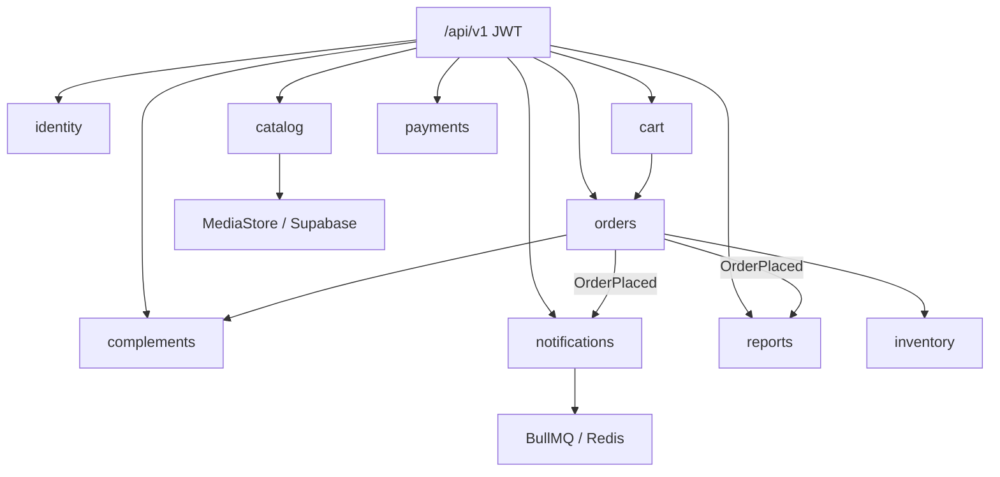

# 09 — Árbol de archivos (monolito modular NestJS)

La API vive en un solo artefacto NestJS (`apps/api`). Los paquetes son **módulos de dominio**, no capas técnicas globales.

> Histórico Spring Boot/MySQL (Maven): ver docs `00–08` y `DOCUMENTACION.md` / `REESTRUCTURA.md` (archivados como referencia de dominio).

```
.
├── package.json                 # workspace pnpm
├── pnpm-workspace.yaml
├── Dockerfile
├── docker-compose.yml           # api + redis + postgres local
├── .env.example
├── apps/api/
│   ├── prisma/
│   │   ├── schema.prisma
│   │   ├── migrations/
│   │   └── seed.ts
│   ├── src/
│   │   ├── main.ts
│   │   ├── app.module.ts
│   │   ├── shared/              # prisma, auth, errors, media, events, health
│   │   └── modules/
│   │       ├── identity/
│   │       ├── catalog/
│   │       ├── inventory/
│   │       ├── cart/
│   │       ├── orders/
│   │       ├── payments/
│   │       ├── notifications/
│   │       ├── reports/
│   │       └── complements/     # cupones, reseñas, favoritos, blog, flags
│   └── test/                    # Jest + Supertest (+ Testcontainers opcional)
└── docs/
```

Cada módulo sigue el mismo interior:

```
*.controller.ts   HTTP + DTOs
*.service.ts      casos de uso
dto/              validación class-validator
```



Arranque: `pnpm install && pnpm --filter api exec prisma migrate deploy && pnpm dev`.
OpenAPI en `/docs`. Media nunca se sirve desde el árbol `src/`.
