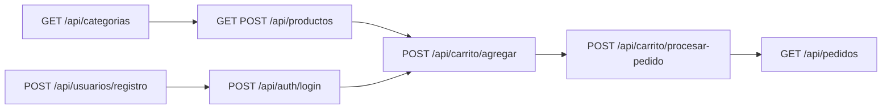

# 09 — Núcleo de guía (código que queda)

Tras borrar código muerto e inacabado, `src/` solo conserva el **ciclo comercial** como referencia. El stack no cambió (Java 17, Spring Boot 3.5, MySQL).

## Qué se dejó

```
Usuario / TipoUsuario
Categoria
Producto
Carritoitem
Pedido / EstadoPedido
Pedidoitem
```

HTTP:

| Prefijo | Rol |
|---|---|
| `/api/auth` | Un login |
| `/api/usuarios` | Registro comprador/vendedor y listados |
| `/api/categorias` | CRUD |
| `/api/productos` | CRUD + stock + por vendedor |
| `/api/carrito` | Alta, cantidad, vaciar, checkout |
| `/api/pedidos` | Por usuario, detalle con líneas, estado, cancelar |

## Qué se eliminó (no copiar en la reconstrucción)

- Blog, eventos, métricas de vendedor, notificaciones, preórdenes, favoritos, reseñas, cupones, direcciones (entidad)
- `ImagenController` / `ImagenService` y binarios en `static/`
- Login duplicado en `/api/usuarios/login`
- CRUD suelto de `/api/pedidoitems`
- Alta de producto con multipart al árbol `src/`
- Flag `espreorden`, `cuponId` ignorado en checkout
- SQL huérfano `data-nuevas-*.sql`
- Artefactos `target/` versionados
- Config de HTML estático que no existía

## Flujo que queda



La reconstrucción debe partir de este núcleo, no reintroducir los módulos borrados hasta que el contrato v1 y la auth existan. Ver [08-PLAN-REMODELACION.md](08-PLAN-REMODELACION.md).
