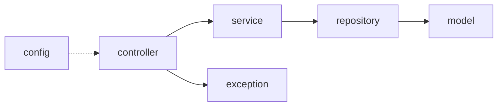

# 09 — Árbol de archivos (sin framework)

Spring Boot y Maven se eliminaron. `src/` es un **árbol de paquetes vacío**.

## Árbol vivo

```
src/main/java/com/minimalecommerce/app/
  config/
  controller/
  service/
  repository/
  model/
  exception/
src/main/resources/
src/test/java/com/minimalecommerce/app/
```

## Relaciones previstas (no implementadas)



Esto **no** obliga a repetir la arquitectura en capas. Es el mapa de carpetas que dejó el prototipo. La nueva arquitectura puede usar estas carpetas o sustituirlas.

Histórico: docs 01–05. Enfoque/stack: 06–08.
