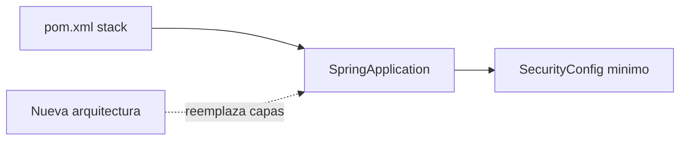

# 09 — Esqueleto (sin controladores)

`src/` ya no tiene la arquitectura en capas del prototipo. Sirve para **montar otra arquitectura** encima del mismo runtime.

## Qué hay

```
src/main/java/com/minimalecommerce/app/
  MinimalecommerceApplication.java
  config/SecurityConfig.java
src/main/resources/application.properties
src/test/.../MinimalecommerceApplicationTests.java
pom.xml · mvnw · .gitignore
```

Se quitó: todos los `@RestController`, `WebConfig` (CORS), `SwaggerConfig`, `GlobalExceptionHandler`, y el `GET /api/health`.

`SecurityConfig` se mantiene porque `spring-boot-starter-security` está en el `pom`: sin cadena de filtros, Boot 3 bloquearía el arranque con login por defecto. Se reescribe con la nueva arquitectura.

JPA/MySQL siguen en dependencias y **no se conectan** hasta quitar `spring.autoconfigure.exclude`.



Histórico de capas y flujos: docs 01–05. Plan: [08-PLAN-REMODELACION.md](08-PLAN-REMODELACION.md).
