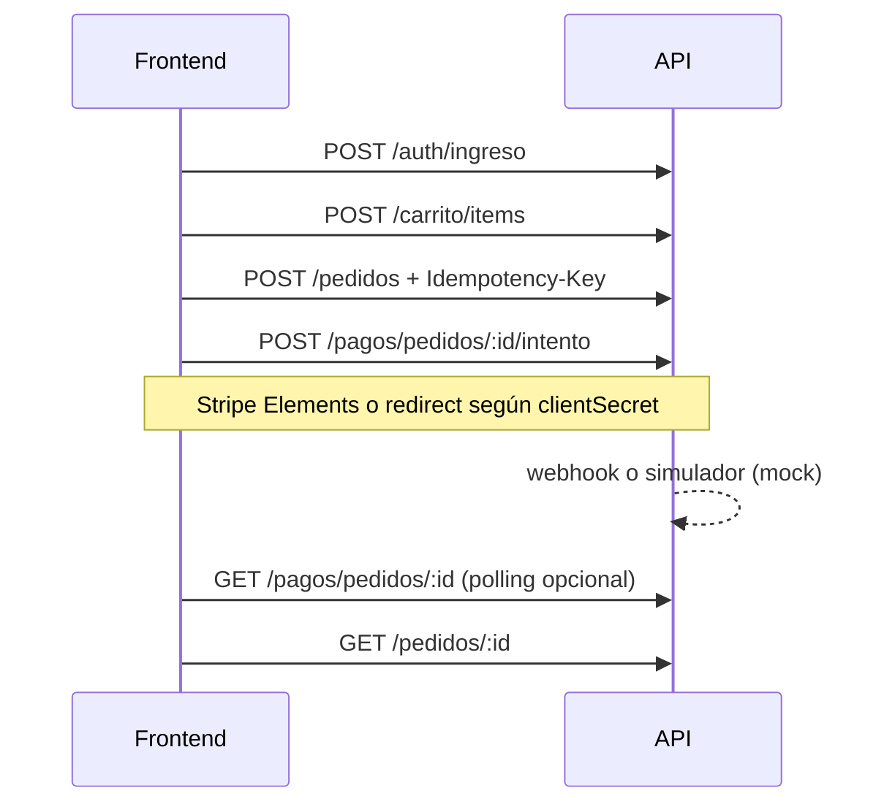

# Análisis de capacidades — MinimalShop API (estado actual)

Monolito NestJS 11 modular en español (`compartido/` + `modulos/`). Prefijo HTTP: **`/api`**, versión por defecto **`v1`**. Salud sin versión: **`/api/salud/*`**.

## Listo para producción de desarrollo / integración frontend

| Área | Capacidad | Notas |
|------|-----------|--------|
| Identidad | Registro, ingreso, refresh rotativo, salir, perfil y direcciones | JWT access 15 min; refresh con detección de reuso |
| Catálogo | Listado paginado (`tamano` ≤ 50), detalle, categorías públicas | Caché Redis con versión; imágenes local o Supabase |
| Vendedor | CRUD productos, publicar/despublicar, imagen, existencias | Política de propiedad del producto |
| Carrito | Resumen con precios vigentes, ítems CRUD | Solo `COMPRADOR` |
| Checkout | Pedido `CREADO`, reserva de stock 15 min, vaciado de carrito | Cabecera obligatoria `Idempotency-Key` |
| Cupones | Validación en checkout; CRUD vendedor; consulta pública limitada | Módulo `cupones` activable |
| Pagos | Intento de pago, consulta estado, webhook Stripe, **simulador mock** | Sin `confirm` del cliente; mock: `POST .../pagos/simulador/pedidos/:id/aprobar` |
| Pedidos | Historial comprador, detalle, cancelar, confirmar recibido | Máquina de estados TCC 8.4 |
| Vendedor pedidos | Listado paginado, cambio de estado post-pago | CU-09 cubierto en e2e |
| Módulos | Flags globales (`cupones`, `resenas`, `favoritos`, `contenido`, `notificaciones`) | 409 `MODULE_DISABLED` |
| Reseñas | Listado público por producto; crear si pedido `ENTREGADO` | Módulo `resenas` |
| Favoritos / contenido | Favoritos del comprador; blog y eventos | Tras activar módulo |
| Notificaciones | Lista paginada, marcar leída; correo SMTP o consola | Asíncrono vía BullMQ |
| Reportes | Métricas vendedor; resumen plataforma (superadmin) | Escucha `PedidoPagado` |
| Observabilidad | `x-correlation-id`, Pino, errores tipificados | `/api/salud/vida` y `/api/salud/listo` |
| Seguridad | Helmet, CORS, throttling Redis, RLS endurecido en Postgres | Validación de entorno al arrancar |

## Flujo de compra recomendado (frontend)

En **mock** (desarrollo), un superadmin puede llamar al simulador para cerrar el flujo sin Stripe.

## Limitaciones conocidas

- **Jobs de mantenimiento** (liberación de reservas y conciliación): intervalos en proceso, no colas BullMQ repetibles en cluster.
- **Webhook Stripe en e2e**: no automatizado en CI (requiere firma); el simulador mock cubre CU-04 en tests.
- **Cobertura unitaria de aplicación**: prioridad en dominio; servicios grandes (auth, catálogo) dependen más de e2e.
- **Multi-tienda**: una sola tienda; flags de módulo son globales.
- **OpenTelemetry / métricas Prometheus**: fuera de alcance actual.

## Criterios de cierre Fase 5 (referencia)

| Criterio | Estado |
|----------|--------|
| CU-01, CU-03, CU-04, CU-09 vía API | ✅ Cubiertos en e2e (CU-04 vía simulador mock) |
| Swagger alineado | ✅ Plugin Nest + DTOs; `SWAGGER_ENABLED` |
| Tests CI verdes | ✅ Unit + e2e + build |
| gitleaks | ✅ En workflow |
| Documentación contrato / frontend | ✅ `05-CONTRATO-API.md`, `GUIA-FRONTEND.md` |
