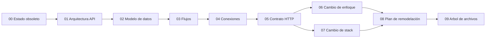

# Documentación de remodelación — MinimalEcommerce API

Este directorio es la **fuente de verdad** para tratar el repositorio como una API obsoleta que hay que remodelar. El código en `src/` no se considera el diseño destino.

## Cómo leerlo

1. Árbol vivo (sin framework): [09-NUCLEO-GUIA.md](09-NUCLEO-GUIA.md).
2. Si vienes del prototipo viejo: [00-ESTADO-OBSOLETO.md](00-ESTADO-OBSOLETO.md) y diagramas 01–04 (histórico).
3. Si vas a **seguir en Spring**: [06-CAMBIO-DE-ENFOQUE.md](06-CAMBIO-DE-ENFOQUE.md) y [08-PLAN-REMODELACION.md](08-PLAN-REMODELACION.md).
4. Si vas a **cambiar de tecnología**: [07-CAMBIO-DE-STACK.md](07-CAMBIO-DE-STACK.md).

Documentos históricos en la raíz (anteriores a esta carpeta):

- [../DOCUMENTACION.md](../DOCUMENTACION.md) — inventario detallado de clases y endpoints
- [../REESTRUCTURA.md](../REESTRUCTURA.md) — fallas y oleadas A/B/C
